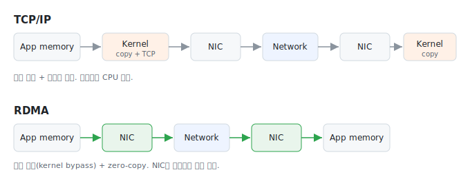

# 1주차: GPU 클러스터는 왜 RDMA를 쓸까

분산 학습에서 GPU가 아무리 빨라도 네트워크가 못 따라오면 GPU가 논다. 1주차에서는 그 네트워크 쪽 이야기, 특히 RDMA가 왜 GPU 클러스터의 기본 전제가 됐는지를 정리했다. 결론부터 말하면 평범한 TCP/IP 스택으로는 GPU 사이에서 오가는 데이터양과 지연 요구를 감당하기 어렵다.

## TCP/IP가 뭐가 문제냐면

데이터를 한 노드에서 다른 노드로 보낼 때 일반적인 경로는 이렇다. 애플리케이션 메모리에서 커널 버퍼로 복사하고, 커널이 TCP/IP 처리를 하고, NIC로 다시 넘긴다. 받는 쪽은 그 역순. 이 과정에서 메모리 복사가 여러 번 일어나고, 패킷마다 CPU가 인터럽트를 받아 처리한다.

수십 GB짜리 gradient를 매 step마다 수백 번 주고받는 학습 잡에서는 이 CPU 개입과 메모리 복사가 그대로 오버헤드가 된다. 대역폭을 키워도 CPU가 병목이라 다 못 쓰는 상황이 생긴다.

## RDMA의 핵심: 커널을 건너뛴다

RDMA(Remote Direct Memory Access)는 NIC가 상대 노드의 메모리에 직접 읽고 쓴다. 커널을 거치지 않고(kernel bypass), 중간 복사 없이(zero-copy) NIC끼리 데이터를 옮긴다. CPU는 전송을 시작시키는 정도만 관여하고 실제 데이터 이동에는 거의 빠진다.

그래서 얻는 게 두 가지다. CPU 사용률이 떨어지고, latency가 줄어든다. 대신 공짜는 아니다. 애플리케이션이 RDMA verbs API를 직접 다뤄야 하고, 메모리를 미리 등록(memory registration)해 둬야 NIC가 접근할 수 있다. 프로그래밍 모델이 소켓보다 까다롭다.

## InfiniBand vs RoCE v2

RDMA를 실제로 까는 방법은 크게 둘이다.

InfiniBand는 RDMA 전용으로 설계된 별도 네트워크 스택이다. 성능은 좋은데 전용 스위치와 NIC가 필요해서 비싸고, 이더넷 인프라와 따로 논다.

RoCE v2(RDMA over Converged Ethernet)는 이름 그대로 RDMA를 이더넷 위에 얹는다. UDP/IP 패킷으로 감싸서 보내기 때문에 기존 이더넷 라우팅 장비를 쓸 수 있다. 문제는 RDMA가 원래 손실 없는(lossless) 네트워크를 가정하고 만들어졌다는 점이다. 이더넷은 기본적으로 패킷을 버릴 수 있어서, PFC(Priority Flow Control)나 ECN 같은 congestion 제어를 제대로 잡아주지 않으면 성능이 확 무너진다. 여기가 실제 운영에서 제일 골치 아픈 부분이라고 들었는데, 튜닝 디테일은 다음에 더 봐야겠다.

## GPU Direct RDMA

여기서 한 단계 더 들어간다. 보통은 GPU 메모리에 있는 데이터를 네트워크로 보내려면 일단 호스트(CPU) 메모리로 한 번 내린 다음 NIC로 넘긴다. GPU와 NIC 사이에 CPU 메모리를 한 번 경유하는 셈이다.

GPU Direct RDMA는 NIC가 GPU 메모리에 직접 접근하게 해서 이 호스트 메모리 경유를 없앤다. PCIe 상에서 GPU와 NIC가 바로 데이터를 주고받는다. 노드 간 all-reduce처럼 GPU 메모리끼리 데이터를 옮겨야 하는 collective 연산에서 이게 latency를 줄여준다. 실제로 NCCL이 가능하면 이 경로를 탄다.

## 다음에 볼 것

collective communication 자체, 특히 ring all-reduce가 어떻게 동작하고 topology에 따라 왜 성능이 달라지는지가 아직 머릿속에서 안 잡힌다. 그리고 RoCE의 congestion 제어(PFC, ECN, DCQCN)는 따로 한 편으로 정리할 만한 주제 같다.

참고한 것: NVIDIA GPUDirect RDMA 문서(<https://docs.nvidia.com/cuda/gpudirect-rdma/>), NCCL 공식 문서.
