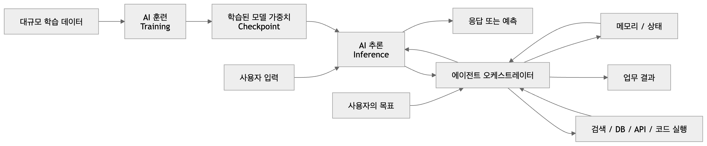
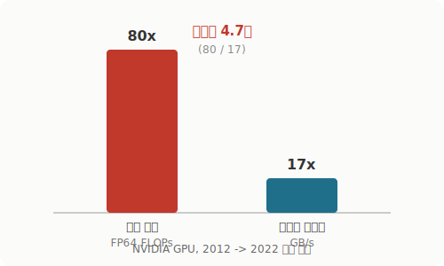
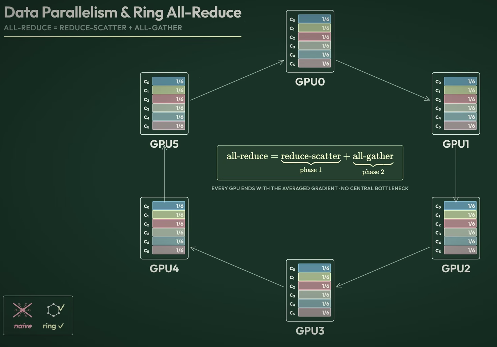
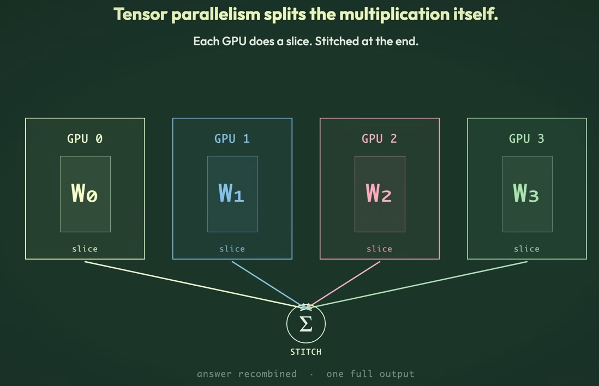
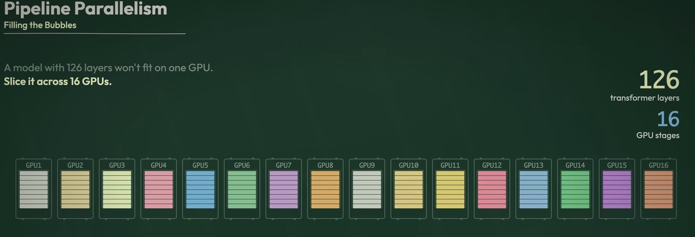
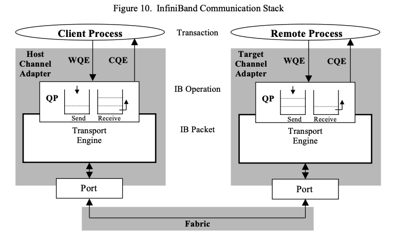
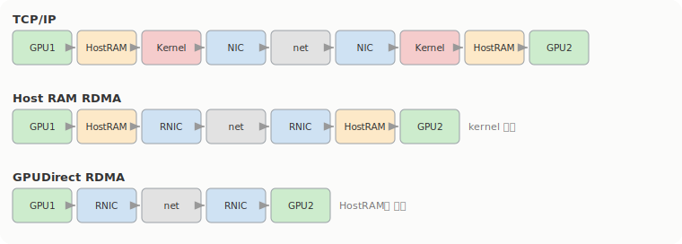
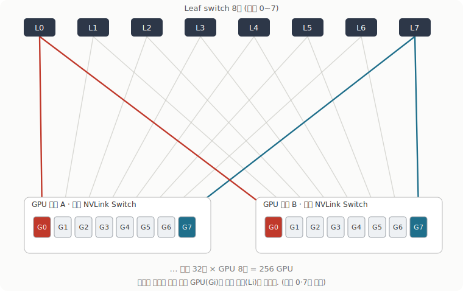

# 1주차: GPU는 빠른데 왜 네트워크가 병목일까

이 스터디 1주차는 AI Data Center Networking이라는 주제로 들어가기 전에, 그 앞단을 통째로 깔고 가는 회차였다. AI 모델이 어떻게 학습되고 추론되는지, 왜 요즘 데이터센터 투자가 추론 쪽으로 쏠리는지, 그리고 정작 GPU 연산 성능은 남아도는데 무엇이 먼저 막히는지를 봤다. 결론을 미리 적으면, 막히는 건 보통 연산이 아니라 데이터를 GPU까지 날라주는 통로 쪽이다. 단일 GPU 안에서는 메모리 대역폭이, GPU 여러 장을 묶는 순간부터는 네트워크가.

## 훈련, 추론, 그리고 에이전틱 AI는 같은 층이 아니다

먼저 용어 정리부터 했는데, 셋이 같은 줄에 놓이는 개념이 아니라는 게 포인트였다. 훈련(Training)은 데이터로 모델의 가중치 자체를 만드는 과정이고, 추론(Inference)은 그 가중치를 고정한 채 입력을 넣어 답을 생성하는 과정이다. 훈련은 한 모델당 사실상 한 번이지만 추론은 요청이 올 때마다 돌아가니까, 운영 비용의 대부분은 추론이 먹는다. 에이전틱 AI는 이 둘과 다른 층인데, 추론을 두뇌로 쓰면서 계획 → 도구 실행 → 결과 확인 → 재계획을 반복하는 애플리케이션 구조다. 에이전트 하나가 작업 하나를 끝내는 데 모델 호출이 50번 넘게 들어갈 수 있다고 한다.

그래서 자료에서 인상적이었던 건 지표가 바뀌고 있다는 얘기다. 이제 `tokens/sec` 같은 처리량보다 '완료된 업무 한 건당 비용(Cost per Successful Outcome)'으로 무게중심이 옮겨가는 중이라고. 에이전트가 추론 호출 수, 토큰 수, 컨텍스트 상태를 한꺼번에 불려놓기 때문에 HBM과 KV Cache, 네트워크, 스케줄링, 스토리지, 전력이 동시에 병목이 된다.

곁가지로 네오클라우드(GPU 서비스에만 특화된 클라우드, GPUaaS) 얘기도 짧게 나왔다. DGX H100 동급 인프라 기준으로 네오클라우드가 시간당 평균 34달러, 하이퍼스케일러가 98달러라 65%쯤 싸다는 비교였는데, 출처가 Medium, Uptime 같은 2차 자료라 숫자 자체는 참고만 하기로.

## 진짜 병목은 메모리 대역폭이다

여기가 1주차에서 제일 많이 곱씹은 대목이다. GPU의 연산 코어는 충분히 빠른데 메모리가 데이터를 그 속도로 못 먹여줘서 코어가 논다. 자료에선 이걸 '데이터 기아' 상태라고 불렀다.

수치로 보면 더 분명한데, 2012년부터 2022년까지 NVIDIA GPU의 연산 성능(FP64)은 80배 늘었지만 메모리 대역폭은 17배밖에 안 늘었다. `80 ÷ 17 ≈ 4.7`, 그러니까 연산과 메모리 공급 사이의 불균형이 10년 새 4.7배로 벌어졌고 이걸 '메모리 장벽(The Memory Wall)'이라 부른다. 이 숫자는 2026년 1월 구글의 샤오위 마와 David Patterson이 낸 논문에서 나온 거라고 한다([arxiv](https://arxiv.org/abs/2601.05047)).

추론을 Prefill과 Decode로 쪼개 보면 왜 이게 문제인지 더 와닿는다. Prefill은 입력 프롬프트를 한 번에 병렬로 처리하는 단계라 GPU가 설계된 목적에 딱 맞는 compute-bound 작업이고, 1만 토큰 프롬프트가 H100에서 200-400ms면 끝난다. 반면 Decode는 토큰을 한 개씩 순차로 뽑는데, 매 토큰마다 모델 가중치(FP16 70B 모델이면 140GB)와 점점 커지는 KV Cache를 메모리에서 다시 읽어야 한다. H100의 메모리 대역폭이 최대 3.35TB/s인데 Decode에서는 코어 대부분이 데이터를 기다리며 논다. TTFT가 300ms인데 토큰당 30ms짜리 Decode를 200번 반복하면 6초, 전체 시간을 Decode가 지배한다. 출력 토큰이 입력 토큰보다 3-10배 비싼 것도 이래서다.

KV Cache는 이전 토큰들의 Attention 계산 결과를 저장해서 재계산을 피하는 캐시인데, 크기가 `배치 크기 × 레이어 수 × 컨텍스트 길이 × Hidden 크기`에 비례해서 커진다. 동시 사용자가 많거나 대화가 길어지면 HBM이 금방 동난다. vLLM의 PagedAttention이 OS 페이지처럼 이 캐시를 블록 단위로 관리해서 낭비를 줄이는 거라는데, 세부 동작은 아직 안 봤다.

참고로 추론 비용은 2022년 말 이후 280배쯤 떨어졌다고 한다. 그래도 여전히 AI에서 가장 큰 비용 항목이고, 하드웨어 연산력과 메모리 처리력의 격차는 계속 벌어지는 중.

## 2조 파라미터는 한 장에 안 들어간다

2조 파라미터 모델을 훈련한다고 치면 물리적으로 GPU 한 장엔 안 들어간다. 파라미터당 16바이트(복사본, gradient, optimizer 상태 등)를 쓰니까 모델 상태만 32TB, H100 80GB로 400장이 필요하다. 연산량은 `4.8 × 10^26` Ops라서, H100 한 장을 이론치의 50%로 굴려도 30700년이 걸린다. 이걸 16384장으로 분산하면 약 2년으로 떨어진다.

분산하는 방식이 곧 병렬화 전략인데, 자료에서 다룬 건 이 정도다.

- **Data Parallelism**: 모델을 모든 GPU에 복사하고 배치를 N개로 쪼갠다. 역전파 뒤 GPU마다 다른 gradient를 평균 내야 하는데, 한 기계에 다 모으면 거기서 병목이 터진다. 그래서 GPU를 논리적 링으로 두고 gradient를 청크로 쪼개 Reduce-Scatter + All-Gather로 도는 Ring All-Reduce를 쓴다. 모든 링크가 동시에 송수신하니 노는 링크가 없다는 게 핵심.
- **Tensor Parallelism**: 행렬 곱 하나를 여러 GPU에 쪼개고 마지막에 합친다. 단계마다 서로를 기다려야 해서, 클러스터에서 제일 빠른 링크에서만 쓸 수 있다. llama3 기준 TP는 한 서버 안 8개 GPU(NVLink로 묶인)로 제한된다.
- **Pipeline Parallelism**: 레이어를 GPU들에 나눠 맡긴다. 순진하게 짜면 GPU가 노는 'bubble'이 생기는데, 마이크로 배치로 채워서 배치 1이 끝나면 즉시 배치 2를 흘려보낸다.
- **Expert Parallelism (MoE)**: Expert를 여러 GPU에 흩뿌리는데, GPU 간 all-to-all 통신이 잦아서 지연시간이 특히 중요해진다.

도식은 'The Engineering Behind Training a 2 Trillion Parameter LLM' 영상 것이 직관적이라 그대로 가져왔다.

무슨 방식을 쓰든 결론은 같다. 쪼개는 순간 GPU들이 끊임없이 서로 통신해야 하고, 그 통신이 곧 네트워크 부하다. NVL72(72개 GPU를 full bandwidth로 묶은 단일 Rack) 얘기가 여기서 나오는데, TP를 8개가 아니라 72개까지 효율적으로 돌릴 수 있게 해줘서 가장 빠른 링크의 범위 자체를 넓히는 그림이다. NVL72가 실제로 뭘 묶는지는 [따로 팠다](nvl72-nvlink/).

규모가 커지면 장애도 일상이 된다. 메타가 Llama3를 16384개 GPU로 54일 돌렸을 때 평균 3시간에 한 번꼴로 장애가 났고, 그런데도 GPU 한 장이 느려지면 나머지 16383장이 멈춰 서야 한다. 전체 419건 장애 중 사람이 크게 개입한 건 3건뿐이었다는 게 인상적이었다. 나머지는 체크포인트로 자동 복구.

여기서 ZeRO 샤딩, Flash Attention, Context Parallelism 같은 건 자료에서도 'Skip'으로 넘어가서 이번엔 깊게 못 봤다.

## 데이터는 어떻게 움직이나: DMA → RDMA → GPUDirect RDMA

통신이 병목이라면 데이터가 어떤 경로를 타는지 봐야 한다. 출발점은 DMA다. CPU가 한 바이트씩 복사하는 대신 DMA 엔진에 출발 주소, 도착 주소, 크기, 방향만 알려주면 NIC나 GPU의 DMA 엔진이 실제 이동을 맡는다. NVMe, NIC, GPU는 이미 다 이렇게 동작한다.

문제는 두 GPU 서버가 평범한 TCP/IP로 통신할 때다. GPU에서 나온 데이터가 Host RAM, user buffer, kernel socket buffer를 거치고 NIC를 타고 나간 다음, 받는 쪽에서 그 단계를 거꾸로 되밟는다. 매 단계가 메모리 복사거나 커널 처리라, 대역폭을 키워도 CPU가 못 따라온다. RDMA(Remote Direct Memory Access)는 이 경로에서 커널과 CPU 복사를 들어낸다. 한 서버의 RNIC가 상대 서버의 '미리 등록된' 메모리에 직접 읽고 쓴다. 그래서 쓰기 전에 메모리를 등록(Memory Registration)해서 페이지를 고정하고 RNIC가 접근할 주소 변환과 권한, key를 만들어 둬야 하고, 통신은 Queue Pair(Send/Receive Queue)와 Work Request로 굴린다. RDMA Write는 원격 메모리에 직접 쓰고 원격 CPU는 데이터 이동에 끼지 않는다는 게 특징. 이 패킷이 실제로 어떻게 생겼고 verbs로 어떻게 거는지는 [한 겹 더 파봤다](rdma-hands-on/).

RDMA를 네트워크에 실어 나르는 방식이 두 갈래다.

- **InfiniBand**: RDMA를 위해 처음부터 설계된 전용 패브릭. 무손실, 저지연이고 SHARP 같은 집계 프로토콜을 받쳐준다. 대신 전용 장비가 필요하다.
- **RoCEv2**: Ethernet + IP + UDP 위에 InfiniBand의 RDMA transport를 그대로 얹은 방식. 기존 이더넷 라우팅 장비를 쓸 수 있다. RoCEv1은 이더넷 링크 계층에 갇혀 지금은 안 쓰고, 현 시점 구현은 사실상 다 RoCEv2다.

GPU 데이터까지 가면 한 단계가 더 있다. RDMA가 Host RAM까지만 되면 GPU 데이터는 호스트 메모리를 두 번 경유한다(`GPU VRAM -> Host RAM -> RNIC -> 네트워크 -> RNIC -> Host RAM -> GPU VRAM`). GPUDirect RDMA는 RNIC가 GPU VRAM에 직접 DMA를 걸어서 그 경유까지 없앤다. 세 경로를 나란히 놓으면 복사·커널 단계가 어디서 빠지는지 보인다.

NCCL이 환경을 보고 NVLink, PCIe P2P, Shared Memory, TCP Socket, InfiniBand Verbs, RoCE, GPUDirect RDMA 중에 경로를 고른다. 같은 노드 안이면 NVLink 직결을 1순위로 두고, P2P가 안 되면 host RAM을 공유 버퍼로 쓰는 SHM으로 떨어진다. Ring과 Tree AllReduce의 차이, NCCL이 이 경로를 고르는 방식은 [여기서 더 봤다](nccl-collectives/).

한 가지 짚고 넘어갈 건, RDMA도 CPU를 완전히 없애지는 않는다는 점이다. 초기 설정, 메모리 등록, Queue 관리, 연결 제어, 오류 처리는 여전히 CPU와 커널 몫이고(Control Path), RDMA가 줄이는 건 반복되는 대용량 전송 경로(Data Path)에서의 개입이다. 둘을 갈라서 보는 게 이 주제를 이해하는 틀 같다.

## 패브릭: 레일로 묶는다

마지막은 이 GPU들을 어떻게 연결하느냐다. AI/ML 워크로드는 데이터 수집·전처리, 모델 학습, 배포·모니터링으로 흐르고, 각 단계가 Storage Fabric, Training Fabric, Inference Fabric처럼 목적이 다른 네트워크를 요구한다.

훈련 패브릭에서 나온 개념이 Rail-Optimized Design이다. 서버 안 GPU들은 내부 스위치(NVLink Switch)로 통신하지만, 8개를 넘어가는 워크로드는 여러 서버로 퍼지면서 동서(east-west) 트래픽을 만든다. 이때 서버마다 같은 번호의 GPU를 같은 번호의 leaf switch(레일)에 매핑해서, 서버 간 통신을 1-hop으로 묶어 지연을 줄인다.

규모 감을 위해 자료가 든 예시는 이렇다. GPU 256개(서버 32대 × 8개)는 스위치당 400Gbps 다운링크 32개짜리 leaf switch 8대로 짤 수 있다. 다운링크를 64개로 늘리면 같은 leaf 8대로 512개(서버 64대 × 8개)까지 받고, 이 규모까지는 spine 계층 없이도 운영된다. 그 위로 올라가면 RoCEv2가 손실 가능한 이더넷에서 어떻게 무손실처럼 버티느냐, 즉 PFC나 ECN 같은 congestion 제어가 다음 무게중심이 된다. InfiniBand와 RoCE의 실제 차이도 결국 거기서 갈린다. PFC와 ECN, DCQCN이 손실 이더넷을 어떻게 버티게 하는지는 [다음 글에서 따로 다뤘다](roce-congestion-control/).
