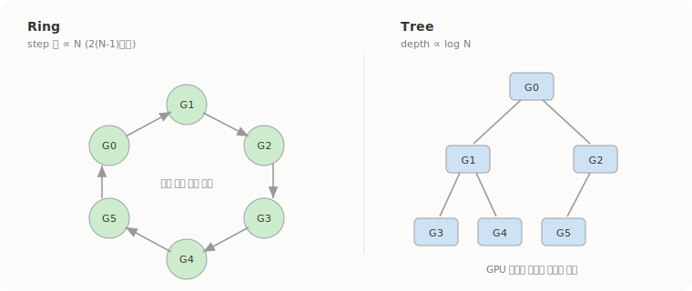

# NCCL collective: AllReduce는 어떻게 도는가

1주차에서 Data Parallelism을 보면서 Ring All-Reduce를 한 번 짚고 넘어갔다. gradient를 청크로 쪼개 GPU 링으로 돌리면 중앙 병목 없이 평균이 맞춰진다는 큰 그림까지. 근데 막상 'NCCL이 실제로 뭘 하느냐'는 안 봤다. 왜 하필 링이 대역폭 최적인지, GPU가 수천 장으로 늘면 그 링이 왜 무너지는지, 그리고 GPU 두 장이 gradient를 주고받을 때 어떤 물리 경로로 만나는지. 이번엔 그 세 가지를 파봤다.

## AllReduce는 사실 두 단계다

NCCL이 제공하는 collective는 몇 개 안 된다. AllReduce, Broadcast, Reduce, AllGather, ReduceScatter 정도가 기본이고, 학습에서 압도적으로 많이 쓰는 건 AllReduce다. NVIDIA 공식 문서는 AllReduce를 "각 device의 데이터를 reduce(sum, min, max 같은)해서 그 결과를 모든 rank의 수신 버퍼에 저장하는" 연산으로 정의한다([NVIDIA NCCL docs](https://docs.nvidia.com/deeplearning/nccl/user-guide/docs/usage/collectives.html)). DDP에서 각 GPU가 자기 gradient를 내놓으면, 끝나고 모든 GPU가 똑같은 '평균 gradient'를 손에 쥐는 그 동작이다.

핵심은 이걸 한 방에 하지 않는다는 거다. **AllReduce = ReduceScatter + AllGather**. 먼저 ReduceScatter로 각 rank가 '전체 합의 한 조각'씩 나눠 갖고, 그다음 AllGather로 그 조각들을 서로 복사해서 전부 채운다. 1주차에서 본 Reduce-Scatter + All-Gather가 바로 이 분해였다. 같은 의미라도 어떻게 짜느냐에 따라 통신량이 갈리는데, 이 ReduceScatter + AllGather 조합이 링 위에서 특히 잘 맞는다.

## 링은 대역폭 최적인데, 단계 수가 GPU에 비례한다

Baidu가 정리한 ring-allreduce 분석을 보면 왜 링을 쓰는지 분명해진다([Andrew Gibiansky / Baidu](https://andrew.gibiansky.com/blog/machine-learning/baidu-allreduce/)). 데이터를 N개 청크로 쪼개고 GPU를 논리적 링으로 두면, scatter-reduce 단계에서 N-1번, all-gather 단계에서 다시 N-1번, 매번 각 GPU가 오른쪽 이웃에 보내고 왼쪽 이웃에서 받는다. 모든 링크가 동시에 일하니까 노는 링크가 없다.

여기서 나오는 숫자가 GPU 한 장이 주고받는 총 데이터량인데, 버퍼 크기 K에 대해 `2(N-1)/N × K`다. N이 커지면 이 값은 2K에 수렴한다. 즉 **GPU를 아무리 늘려도 한 장이 옮기는 데이터량은 거의 안 변한다**. Baidu 글의 표현으로는 "대역폭만 고려하면 ring allreduce가 최적 통신 알고리즘"이고, 통신 비용이 GPU 수와 무관하다.



문제는 저 분석이 대놓고 'latency는 무시하고'라는 단서를 단다는 점이다. 단계가 총 2(N-1)번이니까 GPU가 늘수록 단계 수가 그대로 선형으로 늘어난다. 대역폭은 그대로여도 한 바퀴 도는 데 걸리는 시간이 길어진다. NVIDIA도 이걸 인정하는데, "링의 단점은 latency가 GPU 수에 선형으로 늘어나서 수백 장 위로는 확장을 막는다"고 못 박았다([NVIDIA NCCL 2.4 blog](https://developer.nvidia.com/blog/massively-scale-deep-learning-training-nccl-2-4/)). 메시지가 작을 때, 노드가 많을 때 이 latency가 그대로 병목이 된다.

## 그래서 큰 클러스터에선 Tree로 갈아탄다

NCCL 2.4가 들고나온 게 double binary tree다. 트리로 묶으면 latency가 N이 아니라 log N으로 줄고, 그러면서도 full bandwidth를 유지한다는 게 NVIDIA의 설명이다. 같은 글에서 든 수치가 인상적인데, Summit 슈퍼컴퓨터의 24,576개 GPU까지 테스트해서 링 대비 **최대 180배** latency 개선을 봤다고 한다.

트리인데 왜 대역폭이 안 깎이냐가 궁금했는데, 'double' binary tree라서 그렇다. 이진 트리 하나만 쓰면 절반쯤은 leaf라 통신을 별로 안 하고 논다. 그래서 서로 보완하는 트리를 하나 더 깔아서, 한쪽 트리의 leaf가 다른 트리에서는 일하게 만든다. 그렇게 놀던 대역폭을 회수한다.

실무에서 둘을 손으로 고를 일은 거의 없다. NCCL이 토폴로지를 보고 알아서 정하고, 메시지가 커져서 링이 더 유리해지는 지점이 오면 "다시 링으로 자동 전환한다"고 문서가 밝힌다. 큰 gradient 버퍼는 대역폭 싸움이라 링이, 작고 잦은 메시지는 latency 싸움이라 트리가 이긴다는 감각만 잡고 있으면 된다. `NCCL_ALGO`로 강제할 수는 있는데([env 문서](https://docs.nvidia.com/deeplearning/nccl/user-guide/docs/env.html)), 기본값이 비어 있으면 NCCL이 자동 선택한다.

## GPU 두 장은 어떤 길로 만나나

알고리즘이 'gradient를 어떤 순서로 섞을지'라면, transport는 'GPU 두 장이 물리적으로 어떤 선을 타고 만날지'다. 1주차에서 NCCL이 NVLink, PCIe P2P, SHM, TCP, IB Verbs, RoCE, GPUDirect RDMA 중에 고른다고 나열만 했는데, 그 선택을 좌우하는 게 GPU 사이 '거리'다.

같은 노드 안이면 NVLink 직결 P2P가 1순위, 안 되면 PCIe P2P, 그것도 막히면 host RAM을 공유 버퍼로 쓰는 SHM으로 내려간다. 노드를 넘어가면 IB나 RoCE Verbs로 RDMA를 걸고, NIC와 GPU가 가까우면 GPUDirect RDMA로 host RAM 복사까지 건너뛴다. 이 사다리를 제어하는 환경변수가 `NCCL_P2P_LEVEL`(P2P를 어디까지 허용할지)과 `NCCL_NET_GDR_LEVEL`(GPUDirect RDMA를 어느 거리까지 켤지)인데, 둘 다 `NVL`, `PIX`, `PXB`, `PHB`, `SYS` 식으로 GPU 간 거리에 따라 단계가 매겨진다. 기본은 역시 아키텍처 보고 자동.

전송 프로토콜도 세 단계로 갈린다. `NCCL_PROTO`의 `LL`, `LL128`, `Simple`인데, 이름만 문서에 나오고 각각의 latency/대역폭 수치는 공식 env 문서에 안 적혀 있다. 일반적으로 LL은 작은 메시지용 저지연 대신 유효 대역폭이 깎이고, Simple은 큰 메시지용 고대역폭에 latency가 큰 걸로 알려져 있는데, 이건 내가 NVIDIA 1차 문서에서 수치로 확인한 게 아니라 통념 수준이다. 정확한 tradeoff 숫자는 더 봐야 한다.

## MoE의 all-to-all은 NCCL에 전용 연산이 없다

MoE에서 토큰을 expert가 있는 GPU로 흩뿌리는 all-to-all은, NCCL에 별도 collective로 있을 줄 알았는데 없었다. 공식 문서가 보여주는 건 `ncclSend`와 `ncclRecv`를 `ncclGroupStart()`/`ncclGroupEnd()`로 묶어서 모든 peer에 대해 돌리는 루프다([point-to-point 문서](https://docs.nvidia.com/deeplearning/nccl/user-guide/docs/usage/p2p.html)).

```c
ncclGroupStart();
for (int r=0; r<nranks; r++) {
  ncclSend(sendbuff[r], sendcount, sendtype, r, comm, stream);
  ncclRecv(recvbuff[r], recvcount, recvtype, r, comm, stream);
}
ncclGroupEnd();
```

문서 표현 그대로 "all-to-all 연산은 모든 peer에 대한 send/recv를 합친 루프"다. MoE expert dispatch는 결국 이 패턴 위에 프레임워크가 올린 거고, NCCL 자체는 메커니즘만 제공한다. 1주차에서 EP가 all-to-all 통신이 잦아 latency가 특히 중요하다고 했는데, 그 잦은 작은 메시지가 바로 위 루프가 매 토큰 라우팅마다 도는 모양이다. 링이든 트리든 transport든, NCCL의 선택은 한결같이 네트워크 토폴로지를 먼저 본 다음에 정해진다.
