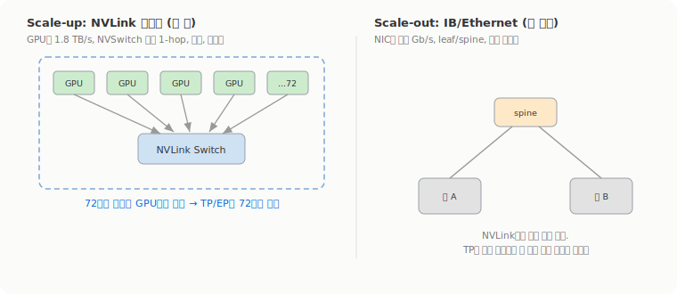

# NVL72: 72개 GPU를 NVLink 한 도메인으로

1주차에서 Tensor Parallelism을 보면서 막혔던 지점이 있다. TP는 행렬 곱을 GPU들에 쪼개고 단계마다 서로를 기다려야 해서, 클러스터에서 제일 빠른 링크에서만 쓸 수 있다고. llama3 기준으로 TP가 한 서버 안 8개 GPU(NVLink로 묶인)로 제한된다는 것도. 그리고 자료가 NVL72를 언급하면서 'TP를 8개가 아니라 72개까지 효율적으로 돌리게 해서 가장 빠른 링크의 범위 자체를 넓힌다'고 했는데, 그 NVL72가 실제로 뭔지는 안 봤다. 그래서 NVIDIA 자료로 따로 확인했다.

## NVL72는 한 랙을 GPU 한 장처럼 쓰는 물건이다

GB200 NVL72는 한 랙에 Blackwell GPU 72개와 Grace CPU 36개를 수랭으로 욱여넣은 시스템이다([NVIDIA 제품 페이지](https://www.nvidia.com/ko-kr/data-center/gb200-nvl72/)). 구성을 뜯어보면 compute tray 18개와 NVLink switch tray 9개로 짜이는데, compute tray 하나가 Grace 2개 + Blackwell 4개라 18 × 4 = 72로 떨어진다([NVIDIA 기술 블로그](https://developer.nvidia.com/blog/nvidia-gb200-nvl72-delivers-trillion-parameter-llm-training-and-real-time-inference/)).

핵심은 이 72개가 따로 노는 72개가 아니라 **하나의 NVLink 도메인으로 묶여 한 장의 GPU처럼 동작한다**는 점이다. NVIDIA 표현 그대로 "72개 GPU 전부가 하나의 GPU로 동작하게 한다"([NVLink/NVSwitch 블로그](https://developer.nvidia.com/blog/nvidia-nvlink-and-nvidia-nvswitch-supercharge-large-language-model-inference/)). 1주차에서 본 NVLink Switch가 서버 안 GPU를 묶던 그 스위치인데, NVL72는 그걸 랙 전체로 키워서 9개의 switch tray가 72개 GPU의 NVLink 포트를 다 받아낸다.

## 5세대 NVLink 숫자를 곧이곧대로 보기

GPU 한 장의 NVLink 대역폭이 양방향 **1.8 TB/s**다([NVLink 페이지](https://www.nvidia.com/en-us/data-center/nvlink/)). Blackwell GPU 하나가 100 GB/s짜리 NVLink 링크를 18개까지 쓰니까 18 × 100 GB/s = 1.8 TB/s로 맞아떨어진다. Hopper 세대의 900 GB/s에서 두 배로 올린 값이고, NVIDIA는 이게 PCIe Gen5의 14배가 넘는다고 적는다.

자주 보이는 '130 TB/s'라는 숫자는 결이 다르다. 이건 72개 도메인 전체를 더한 aggregate인데, 72 × 1.8 TB/s = 129.6이라 거기서 나온 hero number다. 그러니까 130 TB/s를 GPU 한 장이나 한 쌍의 수치로 읽으면 안 되고, 정밀하게 가려면 per-GPU 1.8 TB/s를 쓰는 게 맞다. NVSwitch 칩 하나의 양방향 대역폭은 25.6 Tb/s(테라'비트', = 3.2 TB/s)다. 가끔 도는 7.2 TB/s 같은 값은 NVIDIA 1차 자료에서 확인이 안 돼서 안 썼다.

## 8개 벽을 NVLink 도메인이 넘는 방식

1주차의 그 제약을 다시 떠올려보면, TP는 한 단계 끝낼 때마다 GPU들이 결과를 맞춰야 해서 링크가 느리면 그 대기가 그대로 비용이 된다. 그래서 NVLink로 묶인 한 서버 8개 GPU 안에서만 효율적이었고, 그 너머로 나가면 훨씬 느린 InfiniBand를 타야 했다. 'TP는 8개로 제한'이라는 건 사실 한 HGX/DGX 서버가 NVLink로 묶는 GPU가 8개라는 이전 세대의 물리적 한계에서 온 거다. NVIDIA가 'TP는 8개가 상한'이라고 못 박은 문장을 찾은 건 아니라서, 이건 통상적으로 알려진 제약으로 본다.

NVL72가 바꾸는 건 그 NVLink 도메인의 크기다. 도메인이 8개가 아니라 72개니까, TP나 Expert Parallelism을 한 서버에 가두지 않고 72개 GPU에 펼칠 수 있다. NVIDIA가 직접 보증하는 사실은 '72개가 하나의 GPU로 동작한다'는 거고, TP의 all-reduce 류 통신이 대역폭에 묶이는 작업이라 그걸 1.8 TB/s NVLink가 받아준다는 그림이다. 1주차의 '가장 빠른 링크의 범위 자체를 넓힌다'가 정확히 이 얘기였다. 제일 빠른 링크(NVLink)가 닿는 GPU 수를 8에서 72로 키운 거니까.

## Scale-up과 scale-out은 닿는 거리가 다르다

NVLink는 scale-up이다. 랙 안에서 구리 케이블로 GPU를 직결하고, NVSwitch를 통한 1-hop이라 지연이 낮고 무손실이다. 반대로 랙을 넘는 통신은 scale-out이고 여기서 InfiniBand나 Ethernet이 등장한다. NVIDIA 1차 페이지에 'scale-up은 NVLink, scale-out은 IB'라고 한 문장으로 대조한 곳을 못 찾아서 이 구분은 구조에서 합성한 거지만, 1주차에서 본 Scale-Up/Scale-Out 구도와 그대로 맞는다.

거리를 단위까지 따지면 차이가 크다. NVLink5는 GPU당 1.8 TB/s(=14,400 Gb/s)인데 InfiniBand NDR은 NIC당 400 Gb/s 수준이다. 한쪽은 byte, 한쪽은 bit고 per-GPU와 per-NIC라 직접 비교는 조심해야 하지만, 같은 GPU를 묶더라도 NVLink 도메인 안에 두는 것과 IB로 랙을 건너는 게 자릿수가 다른 통신이라는 감각은 분명하다. 그래서 TP처럼 매 단계 동기화가 필요한 작업은 NVLink 도메인 안에 들어갈 때 제일 싸고, 도메인을 넘어가는 순간 대기 비용이 커진다.

한 가지 헷갈리기 쉬운 게, 5세대 NVLink Switch System의 이론상 최대는 576개 GPU 한 도메인(1 PB/s 초과)인데 NVL72 제품이 묶는 건 72개라는 점이다. 둘을 같은 숫자로 섞으면 안 된다. 그리고 이 모든 게 랙 안 구리와 수랭을 전제로 한다. 구리라 거리가 짧아 랙 안에 갇히고, 그 밀도를 식히려고 수랭을 쓴다. 전력이나 단가 같은 운영 비용은 NVIDIA 1차 자료에서 숫자를 확인하지 못해 여기선 적지 않는다. 결국 NVL72가 하는 일은 새 통신 기술을 발명한 게 아니라, 1주차에서 본 NVLink를 랙 규모로 키워 scale-up이 감당하는 GPU 수를 늘리고, 그만큼 느린 scale-out에 의존할 일을 미루는 쪽이다.
