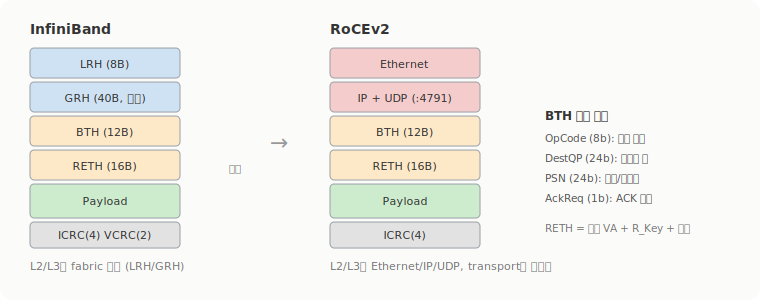
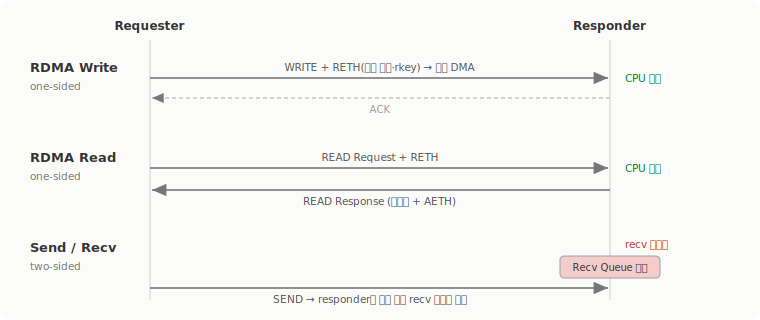

# RDMA 실전: InfiniBand 패킷 구조와 verbs

1주차에서 RDMA를 'RNIC가 상대 서버의 등록된 메모리에 직접 읽고 쓴다'는 개념까지 봤다. Queue Pair, Work Request, Memory Registration 같은 단어도 이름만 스쳤다. 근데 그 패킷이 실제로 어떻게 생겼는지, 코드로는 어떻게 거는지는 안 봤다. 스터디가 추천 자료로 걸어둔 ziwon의 [ai-data-center-network 레포](https://github.com/ziwon/ai-data-center-network/blob/main/ai-data-center-network/ib-packet-analysis/README_KO.md)가 패킷 캡처랑 verbs 예제 코드를 같이 풀어놔서, 그걸 따라가며 한 겹씩 벗겨봤다.

## 패킷은 헤더를 겹겹이 두른 양파다

InfiniBand 패킷은 헤더가 순서대로 쌓인다. LRH, GRH(선택), BTH, 동작에 따른 확장 헤더, payload, 그리고 끝에 CRC 두 개. 레포의 [패킷 포맷 레퍼런스](https://raw.githubusercontent.com/ziwon/ai-data-center-network/main/ai-data-center-network/ib-packet-analysis/packet-format-reference_KO.md)가 각 헤더의 byte 크기까지 박아놨다.



- **LRH** (8B)는 fabric 안의 L2 라우팅이다. 목적지/출발지 LID, virtual lane, 패킷 길이가 들어간다.
- **GRH** (40B)는 서브넷을 넘을 때만 붙는 글로벌 라우팅 헤더라 평소엔 생략된다.
- **BTH** (12B)가 transport의 심장이다. 여기에 OpCode, 목적지 QP, PSN이 들어간다.
- **RETH** (16B)는 RDMA 동작에만 붙는데, 원격 메모리의 Virtual Address(64비트), R_Key(32비트), DMA 길이(32비트)를 담는다. 상대 메모리 어디에 쓸지를 이 헤더가 통째로 지정하는 셈.

BTH를 좀 더 보면, OpCode 1바이트가 transport 종류(상위 3비트)와 동작(하위 5비트)을 같이 인코딩한다. 상위 3비트가 `000`이면 RC(Reliable Connection), `011`이면 UD 같은 식이고, 하위가 동작을 가른다. 그래서 `0x0A`는 RC RDMA WRITE Only, `0x0C`는 RDMA READ Request, `0x04`는 SEND Only로 읽힌다. 그 뒤로 24비트 DestQP가 어느 큐로 갈지, 24비트 PSN이 순서와 재전송을 책임진다. PSN은 2^24에서 한 바퀴 돈다.

## RoCEv2는 transport만 빼서 이더넷에 얹는다

1주차에서 RoCEv2를 'Ethernet + IP + UDP 위에 InfiniBand의 RDMA transport를 그대로 얹은 것'이라고 정리했는데, 패킷으로 보니 정확히 그 말이었다. IB의 LRH/GRH 자리를 Ethernet/IP/UDP가 차지하고, BTH 이하 transport 헤더와 payload는 손대지 않는다. UDP 목적지 포트는 **4791**로 고정이라([RoCE 표준](https://en.wikipedia.org/wiki/RDMA_over_Converged_Ethernet)), 스위치가 이 포트만 보고 RoCE 트래픽을 알아본다.

이게 코드에서 그대로 드러난다. RoCEv2로 QP를 RTR(Ready To Receive) 상태로 올릴 때, 레포의 예제는 `is_global = 1`로 GRH를 강제하고 `dlid = 0`(RoCE에선 LID가 의미 없음)으로 두고, 상대 IP를 GID에 인코딩해서 넣는다.

```c
.ah_attr = {
    .is_global = 1,           // RoCE는 GRH 필수
    .dlid      = 0,           // RoCE: LID 의미 없음
    .grh = {
        .dgid       = peer->gid,   // 상대 IP를 GID로
        .sgid_index = GID_INDEX,   // RoCEv2는 보통 3
    },
},
```

레포가 콕 짚는 함정이 `is_global = 0`인데 GID를 쓰면 연결이 조용히 실패한다는 점이다. 에러도 안 뜨고 그냥 안 붙는다. GID index도 RoCEv2는 보통 3, 순수 IB는 0이라 잘못 고르면 RTR에서 말없이 깨진다.

## verbs의 객체들: 등록하고, 큐에 넣고, 완료를 줍는다

RDMA 프로그래밍은 객체 계층이 분명하다. 레포가 그린 트리가 깔끔하다.

```
Context (HCA 핸들)
  └─ PD (Protection Domain, 보안 경계)
       ├─ MR (Memory Region, 등록된 메모리)
       ├─ QP (Queue Pair) ── SQ(Send) + RQ(Receive)
       └─ CQ (Completion Queue)
```

흐름은 이렇다. 쓸 메모리를 `ibv_reg_mr`로 등록해서 페이지를 고정하고 RNIC가 접근할 lkey/rkey를 받는다. 그다음 Work Request(WR)를 만들어 Send Queue나 Receive Queue에 post하면, 드라이버가 그걸 하드웨어 포맷인 WQE로 바꿔 큐에 넣고, RNIC가 처리한 뒤 결과를 Completion Queue에 WC(=CQE)로 떨군다. lkey는 내 쪽 메모리 참조에, rkey는 상대가 내 메모리에 접근할 때 쓴다.

여기서 비용 감각 하나. **Memory Registration은 비싼 syscall이라** 동작마다 등록하지 말고 큰 덩어리로 묶어 한 번에 등록하라고 레포가 권한다. lkey와 rkey를 섞어 쓰면 `IBV_WC_REM_ACCESS_ERR`가 뜨고, 접근 플래그를 안 맞춰도(가령 `IBV_ACCESS_REMOTE_WRITE` 없이 원격 쓰기) 같은 류의 에러가 난다.

완료 확인은 결국 CQ를 폴링하는 루프다.

```c
do {
    n = ibv_poll_cq(cq, 1, &wc);
} while (n == 0);
if (n < 0 || wc.status != IBV_WC_SUCCESS) { /* 실패 처리 */ }
```

그리고 절대 규칙 하나. WR을 post한 뒤 그 완료(WC)를 받기 전까지 해당 버퍼를 건드리면 안 된다. 중간에 고치면 전송 중인 데이터가 깨진다. 한 줄짜리 규칙인데 이걸 어기면 디버깅이 지옥이 될 만한 종류다.

## Write, Read, Send는 CPU 관여가 다르다

RDMA가 다 똑같이 '상대 CPU를 안 거친다'고 뭉뚱그려 생각했는데, 동작마다 다르다.



RDMA Write와 Read는 one-sided다. 레포 표현으로 "responder CPU가 인지하지 못한 채 진행되고, HCA가 rkey 검증으로 권한을 확인한 뒤 등록된 메모리에 직접 DMA를 건다". Write는 내 RNIC가 상대 메모리에 그냥 쓰고, Read는 상대 메모리에서 끌어온다. 둘 다 상대는 미리 받을 준비를 할 필요가 없다.

반면 Send/Recv는 two-sided다. [RDMAmojo](https://www.rdmamojo.com/2013/01/26/ibv_post_send/)가 정리하듯 SEND는 "원격 QP의 Receive Queue 머리에서 Receive Request를 하나 소비한다". 즉 받는 쪽이 미리 recv를 올려놓지 않으면 `RNR_RETRY_EXC_ERR`로 튕긴다. 이게 RDMA Write/Read에는 해당이 없고 Send에만 걸리는 함정이다. RDMA Write라도 `WRITE_WITH_IMM`처럼 immediate data를 같이 보내는 변형은 예외적으로 recv를 하나 소비한다.

post_send 자체는 의외로 평범하다. SGE에 버퍼 주소와 lkey를 채우고, WR에 opcode와 원격 주소·rkey를 넣어 `ibv_post_send`로 던지면 끝.

```c
struct ibv_send_wr wr = {
    .opcode     = IBV_WR_RDMA_WRITE,
    .send_flags = IBV_SEND_SIGNALED,
    .wr.rdma = { .remote_addr = remote.addr, .rkey = remote.rkey },
};
ibv_post_send(qp, &wr, &bad);
```

`IBV_SEND_SIGNALED`를 모든 WR에 달면 완료마다 CQ 엔트리를 하나씩 먹어서, 레포는 N개에 한 번만 signal하라고 한다. 1KB 미만 작은 메시지는 `IBV_SEND_INLINE`으로 lkey 조회를 건너뛰는 것도 같은 결의 최적화고.

여기까지가 코드 한 쪽 얘긴데, 레포가 마지막에 던지는 말이 의미심장하다. "코드는 동일하고, 성능 차이의 90%는 네트워크 설정이 결정한다". RoCEv2를 제대로 굴리려면 스위치에 PFC와 ECN을 깔아야 하고, MTU도 IB는 256에서 4096까지 고르지만 RoCEv2는 9000 jumbo frame에 묶인다. verbs로 Write 한 줄을 깔끔하게 거는 것과, 그게 손실 이더넷 위에서 안 무너지게 하는 건 완전히 다른 문제라는 거다. 그 90%를 [다음 글](../roce-congestion-control/)에서 따로 팠다.
