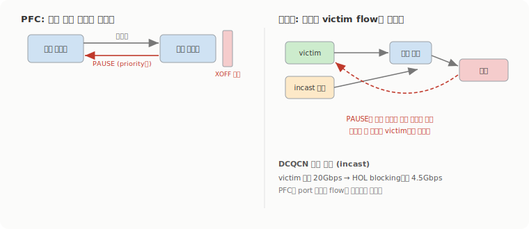
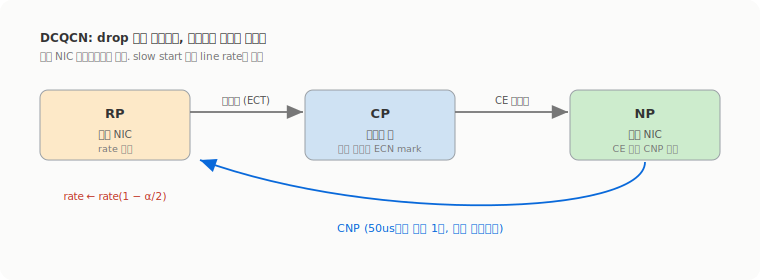

# RoCEv2는 손실 이더넷에서 어떻게 버티나: PFC, ECN, DCQCN

1주차는 이 질문을 열어놓고 끝났다. RoCEv2가 손실 가능한 이더넷 위에서 어떻게 무손실처럼 버티느냐, PFC나 ECN 같은 congestion 제어가 다음 무게중심이 된다고. 그게 InfiniBand와 RoCE가 갈리는 지점이기도 하고. 그래서 따로 파봤는데, 이 주제는 노션 자료엔 없어서 DCQCN 원논문과 마이크로소프트의 대규모 운영 논문을 직접 읽고 정리했다. 결론부터 적으면, RoCEv2의 무손실은 공짜가 아니고 부작용이 꽤 사납다.

## RDMA는 패킷이 떨어지면 성능이 절벽처럼 무너진다

RDMA transport는 NIC 하드웨어에 구현돼 있고, 설계 단계부터 무손실 fabric을 가정한다. DCQCN 논문이 대놓고 "구현을 단순하게 하려고 무손실 네트워크를 가정한다"고 적는다([Zhu et al., SIGCOMM 2015](https://conferences.sigcomm.org/sigcomm/2015/pdf/papers/p523.pdf)). InfiniBand는 원래 hop-by-hop credit 흐름 제어로 L2를 무손실로 만들어서 L4를 단순하게 가져갔는데, RoCEv2는 그 IB transport를 IP/UDP/Ethernet에 그대로 얹었으니 똑같이 무손실 L2가 필요해진다.

손실이 나면 얼마나 무너지는지가 인상적이다. ConnectX-3 Pro는 단순한 go-back-N 복구를 쓰는데, 논문은 "패킷 손실률이 0.1%를 넘으면 throughput이 빠르게 무너진다"고 보고한다. 마이크로소프트의 [RDMA over Commodity Ethernet at Scale](https://www.microsoft.com/en-us/research/wp-content/uploads/2016/11/rdma_sigcomm2016.pdf)은 더 끔찍한 사례를 남겼다. 초기 NIC가 go-back-N도 아니고 go-back-0이었는데, 256개에 하나씩(0.4%) 결정적으로 떨어뜨리는 환경에서 **application goodput이 0으로 떨어지는 livelock**에 빠졌다. 4MB 메시지면 4000패킷인데 첫 256개 중 하나는 항상 떨어지고, NAK을 받으면 패킷 0부터 다시 보내니까 영원히 처음으로 되돌아가는 거다. 그들의 처방은 go-back-0을 go-back-N으로 바꾸는 거였고, "RDMA transport는 go-back-N을 구현해야 하고 go-back-0을 구현하면 안 된다"고 못 박았다.

그냥 TCP를 쓰면 안 되나 싶지만, 논문 측정으로 2KB 전송에서 TCP latency가 25.4us인데 RDMA는 1.7us였고, 4MB 메시지를 보낼 때 TCP는 코어 전체에서 평균 20% 넘는 CPU를 먹는 반면 RDMA 클라이언트는 3% 미만이었다. 이 CPU와 latency를 포기 못 하니까, 손실을 없애는 쪽으로 간다. 그 역할을 L2에서 PFC가 맡는다.

## PFC: 큐가 차면 상류를 통째로 멈춘다

PFC(Priority Flow Control, IEEE 802.1Qbb)는 단순하다. 스위치나 NIC의 ingress 큐가 일정 임계(XOFF)를 넘으면 상류 쪽에 PAUSE 프레임을 보내서 그 링크의 송신을 멈추게 하고, 큐가 다른 임계(XON) 밑으로 떨어지면 RESUME을 보내 다시 흐르게 한다. priority class를 최대 8개까지 두고, PAUSE 프레임이 어느 priority를 멈출지를 지정한다. 덕분에 버퍼가 넘쳐 패킷을 떨구는 일이 없어진다.

공짜가 아닌 첫 지점이 headroom 버퍼다. PAUSE를 보낸 뒤 상류가 실제로 멈출 때까지 'gray period' 동안 도착하는 패킷을 흡수할 공간을 ingress 포트마다 미리 잡아둬야 한다. 이 크기가 MTU와 상대 포트의 반응 시간, 그리고 무엇보다 전파 지연으로 정해진다. RoCE@Scale은 최대 300m 거리에 9MB, 12MB짜리 얕은 버퍼를 쓰니 "스위치가 8개 traffic class를 지원해도 무손실은 2개분만 headroom을 잡을 수 있다"고 적는다. DCQCN 논문은 1500바이트 MTU에서 포트·priority당 22.4KB가 비행 중(in-flight)일 수 있다는 worst-case 수치를 준다. 참고로 초기엔 priority를 VLAN 태그의 PCP에 실었는데 VLAN ID와 분리가 안 돼 L3를 못 넘는 문제가 있어서, IP 헤더의 DSCP로 옮긴 DSCP 기반 PFC가 지금 표준처럼 쓰인다.

## PFC의 진짜 문제는 flow를 구분 못 한다는 것

PFC는 port(혹은 port+priority) 단위로 동작하고 개별 flow를 구분하지 않는다. 이 거칠음이 사고를 부른다.

DCQCN 논문이 보여주는 parking lot 문제부터. 발신자 넷이 한 수신자로 몰리면, 어떤 포트는 한 flow만 싣고 어떤 포트는 ECMP로 여러 flow를 나눠 싣는데, PAUSE가 port 단위라 한 flow만 탄 발신자가 부당하게 높은 throughput을 가져간다. 측정으로 그 발신자가 20Gbps까지 먹는 동안 나머지는 그 아래로 굶었다. 더 고약한 건 victim flow와 head-of-line blocking이다. incast 병목에서 시작된 PAUSE가 leaf와 spine을 거꾸로 타고 번지면, **경로가 전혀 안 겹치는 flow까지 같이 멈춘다**. 논문 표현으로 "자기 경로에 있지도 않은 혼잡 때문에 손해를 보는" 거고, 무관한 발신자를 더 붙이자 victim의 throughput이 기대 20Gbps에서 4.5Gbps까지 떨어졌다.

운영에서 터진 사건들은 더 적나라하다. RoCE@Scale 저자들은 Clos 토폴로지에 up-down 라우팅이라 deadlock이 없을 거라 믿었는데, ARP 테이블 타임아웃(4시간)과 MAC 테이블 타임아웃(5분)이 어긋나면서 생기는 이더넷 flooding이 up-down 라우팅을 깨고 네 스위치 사이에 PFC pause 루프를 만들었다. "deadlock이 한번 생기면 서버를 다 재부팅해도 안 풀린다". 또 NIC 하나가 고장 나 자기 ToR로 pause 프레임을 계속 쏘면 그게 ToR에서 spine을 거쳐 다시 서버로 번져서 "고장 난 NIC 하나가 네트워크 전체의 송신을 막을" 수 있었다. 실제로 한 서버가 초당 2000개 넘는 pause 프레임을 뿜어 "고객 서버의 절반"을 비정상으로 만든 사건이 있었다. 무손실을 얻으려고 켠 PFC가, 장애를 국소화하기는커녕 전파시키는 경로가 되는 셈이다.

## ECN과 DCQCN: 떨구는 대신 표시하고, 끝단에서 속도를 줄인다

PFC가 너무 둔하니까, 그 위에 더 똑똑한 end-to-end 제어를 얹는다. 핵심 재료가 ECN이다. RFC 3168이 정의하듯 ECN은 IP 헤더 TOS 바이트의 두 비트를 써서, 혼잡한 라우터가 패킷을 **떨구는 대신 CE(Congestion Experienced)로 표시**한다([RFC 3168](https://www.rfc-editor.org/rfc/rfc3168)). 표시는 살아서 도착하니까 손실 없이 혼잡 신호만 전달된다.

DCQCN은 이걸 세 지점의 루프로 돌린다. 논문 용어로 발신 NIC가 RP(reaction point), 스위치가 CP(congestion point), 수신 NIC가 NP(notification point)다.

- **CP**(스위치)는 egress 큐 길이가 임계를 넘으면 도착 패킷을 ECN 표시한다. RED 곡선을 쓰는데, 논문이 배포에 쓴 값이 Kmin 5KB, Kmax 200KB, Pmax 1%다.
- **NP**(수신 NIC)는 표시된 패킷을 보면 RoCEv2 표준의 CNP(Congestion Notification Packet)를 발신자에게 되돌려 보낸다. 무한정 보내면 그 자체가 부하라, "flow당 50us마다 최대 한 개"로 제한하고 CNP는 높은 우선순위로 띄워 빨리 도착하게 한다.
- **RP**(발신 NIC)는 CNP를 받으면 현재 rate를 줄이고(rate ← rate(1 − α/2)) 그 값을 기억해뒀다가, 한동안 신호가 없으면 천천히 회복한다. slow start가 없어서 flow가 시작하면 곧장 line rate로 쏜다.

이게 전부 NIC 하드웨어에서 돈다는 게 포인트다. 그리고 ECN이 PFC보다 먼저 동작하도록 버퍼 임계를 설계한다. 논문 결론 표현이 정확한데, "DCQCN은 둔하지만 빠른 PFC로 패킷 손실을 막아주고, 곱고 느린 end-to-end 제어로 전송 rate를 조절해 PFC가 계속 발동되는 걸 피한다". NVIDIA 문서도 RCM이 RFC 3168의 ECN 위에서 CNP로 해당 QP의 주입 rate를 제한한다고 같은 그림을 그린다([NVIDIA RoCE 문서](https://networking-docs.nvidia.com/onyxum/3104706lts/rdma-over-converged-ethernet-roce)). 효과는 분명했다. incast 실험에서 DCQCN 없이 spine 스위치 두 대가 600만 개 넘는 PAUSE를 본 반면, 켜니까 3000개로 줄었고 16배 많은 트래픽을 성능 저하 없이 받았다.

## 그래도 PFC를 못 없애고, 튜닝은 까다롭다

DCQCN이 PFC를 대체하지는 못한다. 논문이 직접 "DCQCN은 PFC의 필요를 없애지 않는다. flow가 line rate로 시작하니까 PFC가 없으면 패킷 손실과 성능 저하로 이어질 수 있다"고 적고, PFC를 끈 채 incast를 돌리니 일부 flow의 10퍼센타일 throughput이 0이 됐다. 빠른 안전망(PFC)과 느린 조절(ECN) 둘 다 있어야 굴러간다는 거다.

튜닝도 만만치 않다. QCN이나 DCTCP의 기본값을 그대로 가져오면 "flow가 수렴하지 못한다". 파라미터가 RTT와 대역폭에 묶여 있어서, 가정한 feedback 지연과 실제가 크게 다르면 값을 다시 잡아야 한다. fairness도 완전히는 못 풀어서, 다중 병목 상황에서 RED 방식이 parking lot을 "완화했지만 완전히 해결하진 못했고" 마킹의 무작위성 때문에 throughput이 출렁이는 부작용까지 따라왔다. RoCE@Scale은 한술 더 떠 무손실 자체를 의심한다. "정말 무손실 네트워크가 있어야 RoCEv2의 이득을 얻을 수 있나"라고 묻고, 프로그래머블 하드웨어에 더 빠른 transport와 FEC를 직접 넣으면 RoCEv2를 무손실 의존에서 풀어줄 수 있다고 본다. 1주차에서 'InfiniBand와 RoCE의 실제 차이는 결국 거기서 갈린다'고 했는데, 갈리는 그 지점이 바로 이 무손실을 IB는 전용 fabric으로 거저 얻고 RoCE는 PFC와 DCQCN을 얹어 어렵게 흉내 낸다는 데 있었다.
