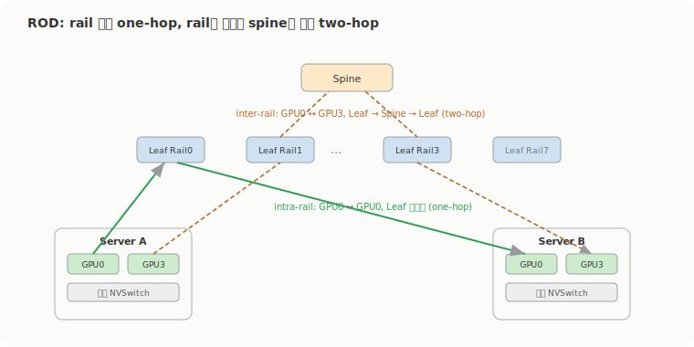

# GPU 클러스터를 어떻게 짜나: 오버서브스크립션, ROD, RUD

2주차의 후반부는 이 GPU들을 실제로 어떤 네트워크에 꽂느냐였다. 앞에서 본 NVLink 사다리가 랙 안 scale-up이라면, 여기는 랙을 넘는 scale-out을 어떤 설계 원칙으로 짜는지다. 스터디가 따라간 교재가 O'Reilly의 'AI Data Center Networking'이라 그 책의 설계 장(章)을 중심으로 정리했다. 큰 목표는 하나로 모인다. 비싼 GPU가 네트워크를 기다리느라 노는 시간을 없애는 것, 그래서 작업 완료 시간(JCT)을 줄이고 패킷 손실을 처음부터 안 만드는 것.

## 왜 이렇게까지: JCT와 tail latency

설계 얘기에 들어가기 전에 지표 두 개를 잡고 간다. 하나가 작업 완료 시간(Job Completion Time, JCT)이다. 여기서 job은 큰 모델을 학습시켜 결과를 얻는 한 덩어리고, 보통 여러 task로 쪼개져 GPU들에서 병렬로 돈다. JCT는 그 job이 시작부터 끝까지 걸리는 시간이라, AI/ML fabric의 핵심 KPI다. JCT를 낮추려면 fabric에 혼잡이 없고, 로드 밸런싱이 잘 되고, tail latency가 낮아야 한다. 고용량 포트의 초고속 스위치를 찾는 이유가 결국 이 JCT다.

다른 하나가 tail latency, 꼬리 지연이다. 대부분의 요청보다 유독 오래 걸리는 높은 백분위수 지연을 말한다. 요청 100개 중 99개가 100ms 안에 끝나는데 1개가 초 단위로 늘어지면, 그 1개가 tail이다. 이게 병렬 작업에서 특히 사납다. 한 job의 task n개가 다 1ms에 끝나는데 task X 하나만 1초가 걸리면, 나머지가 끝나고도 X를 기다리느라 전체 job이 999ms를 더 끈다. 백만 번에 한 번 느려지는 시스템은 훌륭해 보이지만, job을 백만 개 돌리면 매번 그 한 번에 걸린다. 학습 클러스터에선 tail이 JCT를 늘리고, 추론 클러스터에선 사용자 경험을 깎는다. 아래 설계가 혼잡과 경로 쏠림을 줄이려 애쓰는 건 결국 이 꼬리를 짧게 만들기 위해서다.

## 설계의 세 가지 출발점: high-radix, 오버서브스크립션, rail

요즘 AI 클러스터는 GPU 32,000개, 64,000개 단위로 설계된다. GPU마다 NIC가 붙으니 32,000개 GPU면 leaf(ToR) 스위치의 서버 쪽 포트만 32,000개가 필요하고, 그 위로 spine까지 올라간다. 여기서 'radix'는 스위치 한 대가 가진 포트 수를 말한다. 포트가 적은 스위치로 짜면 `GPU → Leaf → Spine → Super-spine → ...`처럼 계층이 깊어지고, 계층이 깊을수록 장비도 케이블도 지연도 장애 지점도 다 늘어난다. radix가 높은 스위치를 쓰면 같은 수의 GPU를 더 적은 계층으로 묶어서 그 비용을 줄인다.

두 번째가 오버서브스크립션 비율이다. leaf 스위치의 서버 쪽(다운링크) 대역폭과 fabric 쪽(업링크) 대역폭의 비율인데, 다운링크가 더 크면 모든 서버가 동시에 최대로 쏠 때 업링크가 못 받는다. 교재의 예시가 직관적이다. 다운링크가 `48 × 10g = 480g`인데 업링크가 `4 × 40g = 160g`면 3:1 오버서브스크립션이다. 반대로 64포트 400G 스위치를 32포트는 서버로, 32포트는 spine으로 나누면 양쪽 다 `32 × 400G = 12.8 Tbps`라 1:1이 된다. 이 1:1을 non-blocking, 또는 full bisection bandwidth라고 부르고, 모든 서버가 동시에 line rate로 통신해도 fabric이 막지 않는 상태다. 훈련 트래픽처럼 line rate를 칠 게 뻔한 구간은 1:1로 가는 게 기본이다.

세 번째가 rail이다. AI 서버는 보통 GPU 8개에 NIC 8개가 번호로 짝지어 있는데(GPU0-NIC0, GPU1-NIC1 식), 서버를 넘어 같은 번호끼리 묶은 네트워크가 rail이다. 8-GPU 서버 클러스터는 GPU 번호별로 8개의 논리 rail로 갈린다. 1주차에서 rail-optimized를 한 번 봤는데, 2주차는 이 rail을 ROD와 RUD라는 두 설계로 끝까지 밀고 간다.

## 네트워크는 용도별로 쪼갠다

GPU 서버 한 대에 물리는 네트워크가 하나가 아니다. 교재는 fabric을 용도로 나눈다. 사용자 요청을 받는 inference fabric(frontend), 학습이 도는 training fabric(backend), 데이터를 대는 storage fabric, 그리고 장비를 관리하는 management fabric. 서버의 포트도 이 용도를 따라 세 종류로 갈린다.

- GPU 학습용 포트는 GPU0-NIC0부터 GPU7-NIC7까지, 서버 간 GPU-to-GPU 통신을 backend training fabric으로 보낸다. AllReduce, AllGather, ReduceScatter, gradient 동기화가 다 여기로 흐르고, 그래서 초고대역폭에 저지연, RDMA, 무손실이 요구된다.
- CPU(northbound/frontend) 포트는 관리, SSH, Kubernetes control plane, 모니터링, 그리고 사용자 inference 요청을 받는다.
- NVMe(storage) 포트는 NVMe-oF로 학습 데이터를 빠르게 읽고 checkpoint를 저장한다. 여기가 느리면 GPU가 데이터를 기다리거나 checkpoint 저장이 오래 걸린다.

용도를 섞으면 큰 학습 트래픽이 나머지를 밀어내니까, fabric을 분리하거나 강한 QoS로 가른다. NVIDIA의 Enterprise Reference Architecture도 같은 그림인데, 4개 compute node를 묶은 Scalable Unit(SU)을 기본 단위로 둔다. 4-node SU에서 compute(east-west) fabric은 노드당 ConnectX-8 SuperNIC 8개로 `64 × 400 Gb/s = 25.6 Tb/s`, converged(north-south) fabric은 노드당 BlueField-3 DPU 1개로 `8 × 400 Gb/s = 3.2 Tb/s`, 관리용은 노드당 `6 × 1 Gb/s`다. 이 SU를 복제해 32 node를 묶으면 B300 GPU 256개, 64 node면 512개, 128 node면 1024개로 늘어난다.

## Rail-Optimized Design: 같은 번호끼리 one-hop으로

ROD의 핵심은 서버 간 통신을 예측 가능하게 만드는 거다. 서버 안 8개 GPU는 내부 스위치(NVSwitch)로 빠르게 통신하지만, 8개를 넘는 학습은 여러 서버로 퍼지며 동서(east-west) 트래픽을 만든다. 이때 같은 번호 GPU를 같은 rail leaf에 모으면, NCCL이 ring이나 tree를 짤 때 경로가 뻔히 보여서 최적화가 쉽다.

거리를 두 가지로 갈라 보면 설계 의도가 또렷하다. 같은 rail 안 통신(intra-rail)은 `Server A NIC0 → Leaf Rail0 → Server B NIC0`이라 leaf 하나만 거치는 one-hop이고 지연이 최소다. 반면 다른 rail끼리(inter-rail), 가령 Server A의 GPU0과 Server B의 GPU3은 leaf가 달라 spine을 타야 한다. `Server A GPU0 → Leaf0 → Spine → Leaf3 → Server B GPU3`이라 two-hop이 되고, 교재 표현으로 intra-rail의 약 2배 지연이다.

규모를 숫자로 보면 이렇다. GPU 256개는 서버 32대 × 8개이고, leaf 8대(rail 8개)에 스위치당 32개 다운링크면 `8 × 32 = 256`으로 떨어진다. 다운링크를 64개로 늘리면 같은 leaf 8대로 512개(서버 64대 × 8개)까지 받고, 이 규모까지는 spine 없이도 효율적으로 돈다. 그 위로 가려면 3-stage Clos로 올린다. 64포트 400G 스위치로 leaf 8 + spine 4를 짜면 256 GPU, 이 (leaf 8 + spine 4)를 2개 row로 복제하면 leaf 16 + spine 8로 512 GPU가 된다.

문제는 더 키울 때 spine이다. GPU가 늘면 서버가 늘고, leaf가 늘고, 업링크가 늘어서 spine 포트와 spine 대수가 같이 분다. spine이 많아지면 ECMP 경로가 늘어 부하 분산이 까다로워지고, 케이블과 장애 도메인이 커진다. 교재가 제시하는 완화책 두 가지가 chassis-based spine과 rail-only design이다. 전자는 64포트 spine 여러 대 대신 256포트짜리 큰 chassis spine을 써서 spine 대수를 1/4로 줄이는 식인데, 장비 단가와 장애 반경이 커지는 걸 감수한다. 후자는 외부 fabric에서 아예 다른 rail을 안 잇고 rail별로만 묶는 설계다. GPU0이 다른 서버의 GPU3과 통신해야 하면 서버 안 NVSwitch로 GPU0→GPU3을 먼저 거친 뒤 Rail3로 내보낸다. inter-rail 외부 통신이 드문 워크로드라면 spine 대역폭을 아껴 토폴로지가 단순해지고 장애 반경도 작아지지만, GPU0이 자주 다른 서버의 GPU3과 통신해야 하면 그 우회가 비용이 된다.

## Rail-Unified Design: 여러 GPU를 한 leaf로 묶기

RUD는 ROD를 뒤집는다. ROD가 GPU별로 leaf/rail을 나눠 꽂는다면, RUD는 한 서버의 여러 GPU를 하나의 leaf 쪽으로 묶는다. 서버의 GPU 8개를 leaf 한 대에 다 붙이거나, 4개씩 leaf 두 대에 나누는 식이다.

장점은 분명하다. 케이블이 단순해지고, 익숙한 데이터센터 구조라 확장도 쉽다. 대신 치명적인 약점이 하나 있는데, 한 서버의 GPU가 전부 leaf 한 대에 매달리면 그 leaf가 죽는 순간 서버 전체가 외부 네트워크에서 고립된다. 지연은 같은 leaf에 붙은 서버 4대까지는 intra-rail이든 inter-rail이든 one-hop이라 제일 낮지만, 다른 leaf의 GPU로 가면 spine을 타는 two-hop이 된다.

RUD는 leaf 하나가 여러 rail을 함께 실어야 해서, 순수 ECMP면 Rail0과 Rail3 트래픽이 같은 spine 경로로 몰릴 수 있다. 그래서 Rail0→Spine0, Rail1→Spine1처럼 rail마다 경로를 고정하는 deterministic forwarding이 필요하다. RUD가 매력적인 쪽은 서버 안 GPU 통신을 내부 스위치 대신 더 빠른 외부 스위치로 받고 싶은 경우인데, NVSwitch가 GPU-to-GPU로 900 Gbps를 주는 걸 외부 DC 스위치로 대체하려면 단가가 더 든다는 trade-off가 따라온다.

## 랙 설계: leaf를 어디 두나 (ToR, MoR, EoR)

마지막은 물리적인 랙이다. ROD에서는 서버 한 대가 leaf 8대에 꽂히니 서버마다 최소 8가닥이 나가고, 32대면 `32 × 8 = 256`가닥이라 leaf를 어디 두고 케이블을 어떻게 빼느냐가 실제 문제가 된다. 참고로 DGX H100 한 대가 8U라 42U 랙에 4-5대 + leaf 1대가 들어가고, 그 전력 예산이 48-60 kW로 현재 데이터센터 평균(20-25 kW)을 훌쩍 넘는다. leaf를 어디 두느냐가 세 가지로 갈린다.

| 구분 | ToR (랙 상단) | MoR (행 중간) | EoR (행 끝) |
|---|---|---|---|
| leaf 위치 | 각 서버 랙 위 | 행 중간 별도 랙 | 행 끝 별도 랙 |
| 케이블 길이 | 가장 짧음 | 중간 | 가장 길 수 있음 |
| 서버 랙 전력/냉각 | 늘어남 | 줄어듦 | 줄어듦 |
| 케이블 비용 | 낮을 수 있음 | 중간 | 높을 수 있음 |
| 최대 케이블 길이 | 8개 랙 | 6개 랙 | 10개 랙 |
| RUD 적합성 | 매우 좋음 | 가능 | 가능 |

ToR은 leaf를 각 서버 랙 맨 위에 둬서 케이블이 제일 짧고 싸다. 특히 RUD와 궁합이 좋은데, RUD는 GPU를 한 leaf로 모으니 랙 위 leaf로 케이블이 거의 랙 안에서 끝나고 DAC 같은 구리 케이블도 쓸 수 있다. 다만 ROD에서는 서버가 여전히 leaf 8대에 꽂혀야 해서, ToR이라도 GPU0은 1번 랙 leaf, GPU1은 2번 랙 leaf 식으로 랙 간 케이블이 남는다. 그리고 leaf가 이미 전력이 빡빡한 AI 랙에 전력과 발열을 더한다.

MoR은 leaf를 행 중간의 별도 랙에 모은다. 서버 랙의 전력 부담은 덜고 leaf 관리는 중앙화되지만, 서버에서 leaf까지 최대 5-6개 랙을 건너서 DAC만으로는 부족해 AEC나 광케이블이 필요해진다. EoR은 leaf를 행 끝에 모으는 방식이라 거리가 더 멀어져(최대 10개 랙) 광 모듈을 거의 써야 하고 케이블 비용과 관리가 더 무거워진다. 정리하면 ToR은 케이블이 짧지만 서버 랙이 더워지고, MoR/EoR은 서버 랙을 식히는 대신 케이블이 길어진다. RUD를 쓴다면 ToR이 가장 자연스럽고, ROD를 큰 규모로 키운다면 케이블 관리를 중앙화하는 MoR이 손이 덜 간다.
