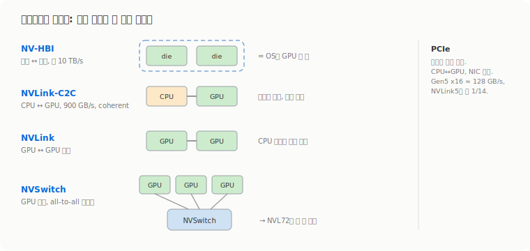

# 다이에서 랙까지, GPU를 잇는 인터커넥트 사다리

2주차 본문의 첫 질문이 'GPU 통신에서 PCIe나 CPU 경유를 왜 피하나'였는데, 그 답이 NVIDIA가 쌓아 올린 인터커넥트 사다리다. 한 패키지 안 다이 두 개부터 랙 한 대까지 GPU를 점점 더 크게 묶어 올리는 그 사다리를 한 칸씩 자세히 봤다. 발표 자료는 고영현 님의 'From A100 to B300' 글([Blog](https://medium.com/@dk02315/from-a100-to-b300-the-evolution-of-nvidia-gpus-and-interconnects-d01a892bd306))을 따라 칩(다이)에서 랙까지 인터커넥트를 한 줄로 세운 거였다. 결국 NVIDIA가 하는 일은 '제일 빠른 한 링크'가 닿는 GPU 수를 계속 늘리는 거라는 게 이 사다리의 큰 그림이다.

## 인터커넥트 사다리: NV-HBI → C2C → NVLink → NVSwitch

같은 'NVLink 계열'이라도 묶는 대상이 뭐냐에 따라 층이 갈린다. 제일 아래는 NV-HBI(High-Bandwidth Interface)다. Blackwell은 칩 하나가 사실 다이 두 개인데, 이 둘을 한 패키지 안에서 약 10 TB/s로 붙여 운영체제에는 단일 GPU 한 장으로 보이게 만든다. 패키징 수준에서 두 조각을 꿰매 한 장처럼 쓰는 단계다.

한 칸 위가 NVLink-C2C(Chip-to-Chip)인데, 여기는 종류가 다른 칩을 잇는다. Grace CPU와 Blackwell GPU를 900 GB/s로 연결하고 메모리를 cache-coherent하게 공유한다([NVLink-C2C](https://www.nvidia.com/ko-kr/data-center/nvlink-c2c/)). 핵심은 GPU가 CPU 메모리를, CPU가 GPU 메모리를 복사 없이 바로 들여다본다는 점이다. 1주차에서 GPUDirect로 호스트 경유를 들어냈던 것과 결이 같은데, 그걸 CPU-GPU 사이로 끌고 내려온 셈.

그 위가 우리가 흔히 말하는 NVLink다. GPU와 GPU를 직접 잇는 고속 프로토콜이자 위 두 가지의 뿌리다. 원래 GPU는 CPU를 거쳐야 다른 GPU와 통신했는데, NVLink가 그 우회로를 없앴다. 마지막이 NVSwitch고, NVLink가 '길'이라면 이쪽은 '교차로'다. 여러 GPU의 NVLink 포트를 한 스위치 칩에 모아서, 어떤 GPU 쌍이든 같은 속도로 직접 통신하는 all-to-all 패브릭을 만든다. 이 네 개가 다이 → 패키지 → GPU 쌍 → GPU 묶음으로 올라가는 사다리다.

## PCIe는 좁은데 안 사라진다

이 사다리 옆에 늘 PCIe가 따라붙는다. PCIe는 CPU와 주변장치(GPU, NIC, SSD)를 잇는 업계 표준 버스인데, 범용이라 호환성은 좋지만 AI가 요구하는 GPU 간 데이터량을 받기엔 좁다. 같은 세대로 비교하면 PCIe Gen5 x16이 약 128 GB/s, NVLink 5세대가 1.8 TB/s라 14배 가까이 벌어진다. NVLink가 애초에 이 PCIe 병목을 우회하려고 만든 GPU 전용 길이라는 게 숫자로 그대로 드러난다.

그렇다고 PCIe가 밀려난 건 아니다. CPU와 GPU를 잇는 표준 경로로, 또 NIC 같은 I/O 장치를 시스템에 붙이는 통로로 여전히 쓰인다. 1주차에서 본 RNIC도 결국 PCIe로 꽂힌다. NVLink는 'GPU끼리의 지름길', PCIe는 '시스템 전체의 표준 도로'라고 갈라 두면 헷갈리지 않는다.

## 레인과 레일은 다른 층이다

발표에서 한 번 짚고 간 게 'lane'과 'rail'의 구분이다. 발음이 비슷해서 섞이기 쉬운데 사는 층이 완전히 다르다. 'lane'은 신호가 흐르는 전선 한 가닥(차동 한 쌍) 수준의 가장 작은 물리 단위다. 이 lane 여러 개를 묶어 링크 하나가 되고, 링크 18개가 모여 GPU당 1.8 TB/s가 된다. 즉 lane은 scale-up 사다리의 맨 밑바닥, 물리 계층 얘기다.

'rail'은 훨씬 위층, 랙을 넘는 scale-out 네트워크의 통로 개념이다. 1주차에서 본 rail-optimized 토폴로지가 그건데, 각 노드의 0번 GPU를 전부 '레일 0' 스위치로, 1번 GPU를 '레일 1'로 묶어서 같은 번호 GPU끼리 전용 통로를 공유하게 한다. 한쪽(lane)은 GPU 한 장 안에서 1.8 TB/s를 만드는 전선 가닥, 다른 쪽(rail)은 NCCL의 AllReduce가 랙을 건널 때 안 부딪히게 짜는 설계다. 단어만 비슷하지 묶는 단위가 자릿수 단위로 다르다.

## 링크당 속도는 어디서 나오나

NVLink 세대 발전을 숫자로 보면 NVIDIA가 매번 같은 카드를 쓴 게 아니라는 게 보인다.

| 세대 | 대표 GPU | 링크 구성 | GPU당 대역폭 |
|---|---|---|---|
| NVLink 3 | A100 | 링크 12개 × 50 GB/s | 600 GB/s |
| NVLink 4 | H100 / H200 | 링크 18개 × 50 GB/s | 900 GB/s |
| NVLink 5 | B200 / B300 | 링크 18개 × 100 GB/s | 1.8 TB/s |

3세대에서 4세대는 링크 수를 12개에서 18개로 늘려 600에서 900으로 올렸다. 그런데 5세대는 방식이 다르다. 링크 수는 18개로 그대로 두고 링크당 속도만 50에서 100 GB/s로 두 배 올려 1.8 TB/s를 만들었다. 같은 핀 수에서 한 가닥의 속도를 끌어올린 거라, 이 '링크당 속도'를 어디서 짜내느냐가 물리 계층의 숙제가 된다.

그 답이 SerDes와 PAM4다. 데이터시트에 자주 보이는 '224G PAM4' 같은 표기가 이 얘기인데, PAM4는 한 번에 2비트를 실어 보내는 변조라 같은 클럭에서 신호율을 끌어올린다. 자료에선 PAM4로 lane당 200 Gb/s급을 낸다고 정리했는데, 200과 224 같은 숫자가 데이터율과 raw 신호율로 갈리는 지점은 더 확인이 필요하다. 어쨌든 NVLink 대역폭이 '링크 수 × 링크 속도'로 떨어지고, 그 링크 속도가 결국 SerDes 한 가닥의 PAM4 신호율에서 온다는 사다리는 분명하다.

## NVSwitch와 SHARP

NVSwitch도 세대마다 꽤 바뀌었다. 2세대(DGX A100, 2020)는 칩 6개로 8개 GPU를 완전 연결했고, 3세대(HGX H100/H200)는 시스템당 칩 4개로 줄이면서 8-GPU 기준 bisection 3.6 TB/s를 냈다. 이 3세대에서 들어온 게 SHARP(in-network compute)다.

SHARP가 흥미로운 건 스위치를 단순한 교차로 이상으로 쓴다는 점이다. AllReduce 같은 집합 통신은 원래 GPU들이 데이터를 주고받으며 합을 맞추는데, SHARP는 그 합산 일부를 스위치 칩 안에서 처리한다. 1주차 NCCL 글에서 본 reduce 연산이 GPU 양 끝 대신 네트워크 한가운데서 일어나는 셈이라, 오가는 데이터량과 홉을 줄인다. 1주차에서 SHARP를 이름만 스치고 지나갔는데, 그게 '스위치가 연산까지 한다'는 뜻이었다.

이 NVSwitch를 랙 규모로 키운 게 NVL72다. 9개의 switch tray가 72개 GPU의 NVLink 포트를 다 받아 한 도메인으로 묶는 그 구조는 [1주차에 따로 팠다](../week1-ai-model-lifecycle/nvl72-nvlink/). 결국 이번 회차의 사다리 전체가 한 방향을 가리킨다. NV-HBI로 다이를 붙이고, NVLink로 GPU를 직결하고, NVSwitch로 묶고, NVL72로 랙까지 키우는 건 전부 '제일 빠른 한 링크'가 닿는 GPU 수를 늘리는 일이고, TP나 Expert Parallelism은 그 안에 들어갈 때 제일 싸다.

세대마다 이 인터커넥트가 어떻게 움직였는지는 GPU 스펙 변천과 같이 봐야 또렷해서 [따로 정리했다](gpu-generations/). A100에서 B300까지 묶는 단위가 어떻게 커졌는지를 보면, 여기서 한 칸 더 올라가 랙과 랙을 잇는 순간 다시 1주차의 scale-out, 즉 IB와 RoCE, 그리고 그 위의 클러스터 설계 질문(ROD/RUD 포함)으로 넘어간다. 이번 주는 그 경계선 이쪽, 랙 안까지를 정리한 회차였다.
