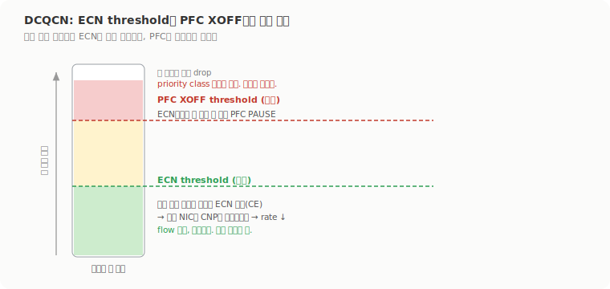

# RoCEv2 혼잡 제어: PFC, ECN, DCQCN, 그리고 그 다음

1주차 끝에 'RoCEv2가 손실 이더넷에서 어떻게 버티나'를 [PFC, ECN, DCQCN](../../week1-ai-model-lifecycle/roce-congestion-control/)으로 한 번 풀었다. 그건 DCQCN 원논문과 마이크로소프트 운영 논문에서 가져온 정리였고, 2주차는 같은 주제를 교재(O'Reilly, AI Data Center Networking) 쪽에서 스위치 설정과 함께 다시 보면서, PFC/ECN/DCQCN 너머의 flowlet, SFC, CSIG까지 밀고 갔다. 출발점이 1주차와 살짝 다른데, '혼잡이 왜 생기나'부터 다시 잡는다.

## 혼잡은 대역폭이 부족해서만 생기는 게 아니다

오버서브스크립션을 1:1로 잡아 non-blocking fabric을 만들어도 혼잡은 생긴다. 1:1은 총량 관점의 균형이지, 트래픽이 특정 링크로 몰리는 걸 막아주진 않기 때문이다. 여러 서버가 같은 목적지로 동시에 보내거나, ECMP 해시가 여러 flow를 같은 링크에 얹거나, 도착 서버의 NIC 대역폭을 넘어서면 그 지점이 막힌다. 고속도로 차선 총량은 넉넉해도 한 진입로가 막히는 것과 같다.

교재는 혼잡이 생길 수 있는 자리를 fabric 곳곳으로 나눠 짚는다.

| 위치 | 무슨 일이 벌어지나 |
|---|---|
| Leaf 로컬 링크 | 같은 leaf의 여러 서버가 같은 로컬 장비로 몰림 |
| Leaf → Spine | 특정 업링크로 몰림 |
| Spine → Leaf | 특정 다운링크로 트래픽이 합쳐짐 |
| Leaf → Server | 마지막 서버로 들어가는 링크가 병목 |
| Spine → Super-spine | 5-stage 설계에서 위로 가는 구간 |

incast가 대표적이다. 서버마다 100Gbps로 쏘는데 storage 서버의 ingress가 100Gbps 한 가닥이면, 서버 둘만 동시에 보내도 200Gbps가 100Gbps로 들어가 큐가 차고 지연이 오르다 떨군다. AI/ML에서 이게 흔한 이유는 AllReduce, AllGather, ReduceScatter 같은 집합 통신이 특정 순간 트래픽을 한곳에 모으고, 여러 노드가 동시에 checkpoint를 저장하기 때문이다. 여기에 한 가지가 더 겹친다. 일반 웹 트래픽은 flow가 많아 ECMP 해시가 평균적으로 흩어지는데, AI/ML은 큰 flow가 몇 개뿐이라 그중 둘이 같은 링크에 얹히면 즉시 막힌다.

## Elephant flow와 flowlet

AI/ML 학습 트래픽의 성격이 두 가지다. 하나는 low entropy다. RoCEv2 IP 헤더는 src/dst 주소만 다르고 거의 같은데, AI/ML은 GPU 1:1 통신이 많아 네트워크 계층 엔트로피가 낮다. UDP 헤더도 목적지 포트가 다 4791이라 전송 계층 엔트로피는 더 낮다. 다른 하나는 high bandwidth다. 각 서버가 NIC를 꽉 채우려 해서(400Gbps NIC면 400Gbps 가깝게) gradient, parameter, activation, checkpoint 같은 큰 데이터가 쏟아진다. 이 둘을 합친 큰 flow가 elephant flow다.

엔트로피가 낮으면 스위치가 서로 다른 flow를 같은 flow로 착각하는 문제가 생기는데, 이 개별 저엔트로피 조각을 flowlet이라 부른다. 스위치는 BTH 안쪽(Destination QP, PSN, OpCode)을 안 보니까, 사실은 QP가 다른 여러 통신이나 다른 job의 트래픽인데도 하나의 큰 flow로 뭉뚱그린다. flowlet이 두 종류로 갈린다. 동시에 흐르는 저엔트로피 flow들(QP/PSN만 다르고 스위치엔 한 flow로 보임)과, 순차로 흐르는 저엔트로피 flow들(Job 1이 끝나고 Job 2가 같은 GPU 쌍으로 시작하면 스위치엔 끊김 없는 한 flow로 보임)이다. 후자가 까다로운 게, 예전에 멀쩡하던 Spine 1이 지금은 막혔는데도 스위치가 같은 flow로 보고 계속 Spine 1로 보내는 식이라, 시간이 지나면 자원을 다시 분배해줘야 한다.

여기에 burst가 더해진다. 병렬화된 gradient는 GPU들이 주기적으로 동기화하니까, 계산 구간엔 네트워크가 조용하다가 gradient 동기화 순간 확 치솟고 다시 가라앉는다. 그래서 교재가 강조하는 처방의 순서가 분명하다. 손실이 난 뒤 복구하는 게 아니라, 손실이 거의 안 나게 만드는 것. ECMP로 경로를 처음부터 잘 흩뿌리는 proactive 쪽을 먼저 깔고, 그래도 몰리면 PFC로 떨굼을 막고 ECN/DCQCN으로 rate를 줄이는 reactive를 받친다. 교재 저자는 load balancing만 제대로 되면 대부분의 경우 ECN/PFC가 발동할 일 자체가 줄어든다고 본다.

## ECN과 DCQCN: 떨구는 대신 표시하고, PFC는 마지막 방어선

ECN은 혼잡한 스위치가 패킷을 떨구는 대신 '혼잡'으로 표시해서 보내는 방식이다. IP 헤더의 마지막 2비트를 쓰는데 `11`이면 혼잡을 겪었다는 표시(CE)고, 받는 쪽은 그걸 보면 RoCEv2의 CNP(Congestion Notification Packet)를 발신자에게 되돌려 보내 해당 flow의 rate를 줄이게 한다. ECN은 스위치 큐 점유가 ECN threshold를 넘을 때 동작하고, 경로를 바꾸진 않는다. '이 경로 혼잡하니 천천히'지 '다른 길로 가'가 아니다. 한계도 분명한데, 발신자에게 알리는 데 시간이 걸려서(혼잡→표시→도착→CNP 생성→발신자 도착) 그 사이 트래픽이 빠르게 늘면 CNP가 닿기 전에 큐가 차서 떨굴 수 있다. 그래서 교재는 ECN만 켠 큐를 'lossy queue'라 부른다. 손실을 줄이지 완전히 막진 못한다.

DCQCN은 그래서 ECN을 PFC와 묶는다. 핵심 설계는 임계값 순서다. ECN threshold를 PFC XOFF threshold보다 낮게 둬서 ECN이 먼저 동작하게 한다.



ECN이 먼저 일하면 발신자가 rate를 줄여 큐가 더 안 자라고, PFC는 끝까지 안 터진다. ECN은 부드럽고 flow 단위인 반면, PFC는 priority class 전체를 멈추는 강한 수단이라(죄 없는 flow까지 같이 멈춘다) 자주 터지면 안 되고 마지막 방어선으로만 둔다. 교재의 t1-t8 그림이 이 순서를 그대로 보여주는데, 큐가 WRED min을 넘으면 ECN 표시(t1-t2) → CNP로 rate 감소(t3) → 그래도 egress 큐가 XOFF를 넘으면 PFC pause(t4-t5) → 큐가 풀리면 resume(t7-t8) 순이다. 여기서 PFC는 hop-by-hop이라는 점이 ECN과 다르다. ECN/CNP는 최종 수신자가 발신자에게 알리는 end-to-end지만, PFC는 인접 장비에게 '잠깐 멈춰'를 보내고 그게 상류로 한 홉씩 번진다. 이 전파가 1주차에서 본 PFC storm과 deadlock의 씨앗이라, PFC watchdog으로 막는다.

역할을 갈라 보면 ECN은 부드러운 브레이크, PFC는 급브레이크, PFC watchdog은 급브레이크가 눌린 채 굳는 걸 막는 안전장치다. 실제 운영 스택은 `ECN + CNP + DCQCN + PFC + PFC watchdog + QoS + 버퍼 임계 튜닝`을 같이 깔고, ECN marked 수, CNP RX/TX, PFC RX/TX, 큐 점유, WRED/Drop, RDMA 재전송 같은 지표를 같이 본다. 참고로 DCQCN의 rate 계산과 조절은 스위치가 아니라 서버 NIC에서 돈다. 스위치엔 RED와 ECN 표시만 있으면 되고, 나머지는 끝단 NIC 몫이다.

## SFC: 목적지를 거치지 말고 발신자에게 바로 알리자

ECN이 느린 게 문제다. 혼잡한 패킷이 목적지까지 가야 거기서 발신자에게 CNP를 보내니까, GPU NIC가 100/200/400/800G로 쏘는 환경에선 그 왕복 동안 큐가 차서 떨군다. PFC는 빠르지만 priority class 전체를 멈춰서 HOL blocking과 storm을 부른다. SFC(Source Flow Control)는 이 둘 사이를 노린다. 혼잡한 스위치가 목적지를 거치지 않고 발신자에게 직접 '이 flow 멈춰'를 보낸다. IEEE 802.1에 올라온 방식이고, Source PFC라고도 부른다.

동작이 영리하다. 혼잡한 스위치가 막힌 flow의 패킷을 보고 Source IP와 Destination IP를 바꿔서(`10.0.1.10 → 10.0.4.20`을 뒤집어 발신자에게 되돌림) 신호를 만든다. payload는 혼잡 알림에 필요 없으니 잘라낸다(payload trim). 그래서 알림 자체가 네트워크에 부담을 안 준다. leaf가 이 신호를 받으면 서버 NIC가 SFC를 지원하면 그 flow만 직접 멈추고, 지원 안 하면 leaf가 PFC로 변환한다.

| 항목 | ECN | PFC | SFC |
|---|---|---|---|
| 알림 방향 | 스위치 → 목적지 → 발신자 | 스위치 → 상류로 한 홉씩 | 혼잡 스위치 → 발신자 직접 |
| 제어 단위 | flow | 트래픽 클래스 전체 | flow |
| 속도 | 느린 편 | 빠르지만 영향 넓음 | 빠르고 영향 좁음 |
| 약점 | CNP 왕복 지연 | HOL blocking, storm | NIC/스위치 지원 필요 |

ECN보다 빠른 건 목적지를 안 거치기 때문이고, PFC보다 영향이 좁은 건 클래스 전체가 아니라 막힌 flow 하나만 제어하기 때문이다. Priority 3에 막힌 flow A와 멀쩡한 B, C가 같이 있을 때 PFC는 셋 다 멈추지만 SFC는 A만 잡는다.

## CSIG: 패킷이 경로 상태를 주워 온다

CSIG(Congestion Signaling)는 한 발 더 나간다. ECN은 '혼잡 있음'만 알리는데, CSIG는 경로의 장비들이 혼잡 정보를 실시간으로 데이터 패킷에 tag로 얹어서, 어느 계층 어느 링크가 얼마나 병목인지를 발신자에게 돌려준다. In-band Network Telemetry(INT)를 혼잡 제어에 쓰는 셈이다. tag는 L2와 L3 헤더 사이, 그러니까 Ethernet 헤더와 IP 헤더 사이에 들어간다.

```text
[Ethernet][CSIG Tag][IP][UDP/RoCEv2][Payload]
```

tag가 담는 게 단순한 비트 하나가 아니라 locator metadata다. 병목 링크의 capacity(100/400/800G 중 뭔지), 병목이 생긴 stage(Leaf/Spine/Super-spine), 장비 ID, 그리고 uplink인지 downlink인지까지 싣는다. 발신자 → 수신자로 가며 tag가 경로 정보를 모으고, 수신자가 그걸 CSIG reflection 헤더로 발신자에게 돌려준다(reflection). ECN이 '받는 쪽이 발신자에게 돌려준다'는 구조는 같은데 정보가 훨씬 풍부하다.

그래서 발신자가 할 수 있는 게 rate를 줄이는 것만이 아니다. 막힌 SpineA 경로를 피해 다른 길을 고르거나, GPU 통신 시점을 미루거나, 혼잡 단계에 따라 rate 조절 강도를 바꾸는 식의 결정이 열린다. ECMP가 현재 혼잡을 항상 반영하진 못하는데, CSIG는 경로 병목을 빠르게 짚어 더 나은 경로 선택을 제안한다. 다만 아직 draft 단계라 표준화가 더 필요하고, 스위치 ASIC과 NOS, 서버 NIC/드라이버가 다 tag를 이해해야 하며, telemetry를 믿을 수 있느냐(위변조 방지) 같은 숙제가 남아 있다. ECN/PFC 중심의 rate 제어를 경로까지 보는 제어로 끌고 가려는 방향인데, 굴러가려면 fabric 전체의 합의가 먼저다.
