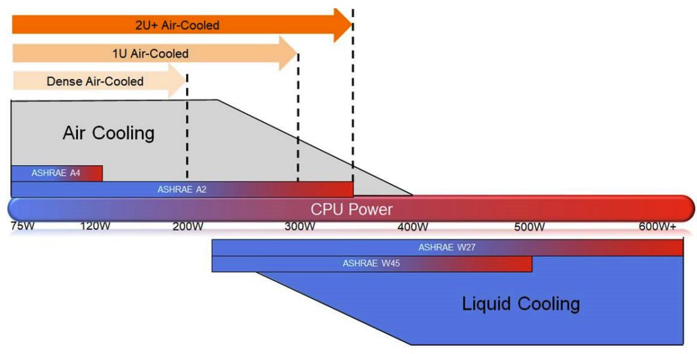
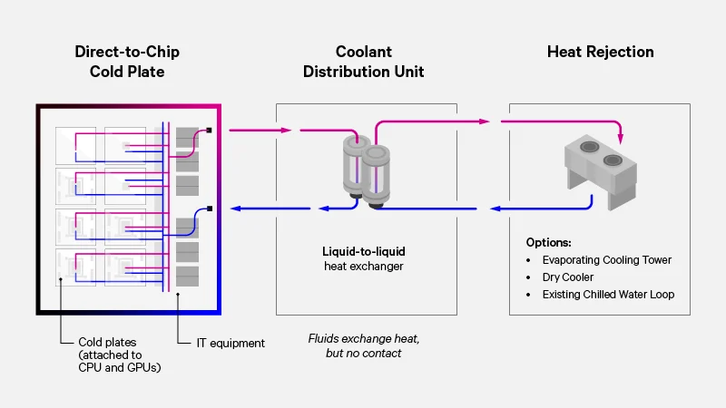
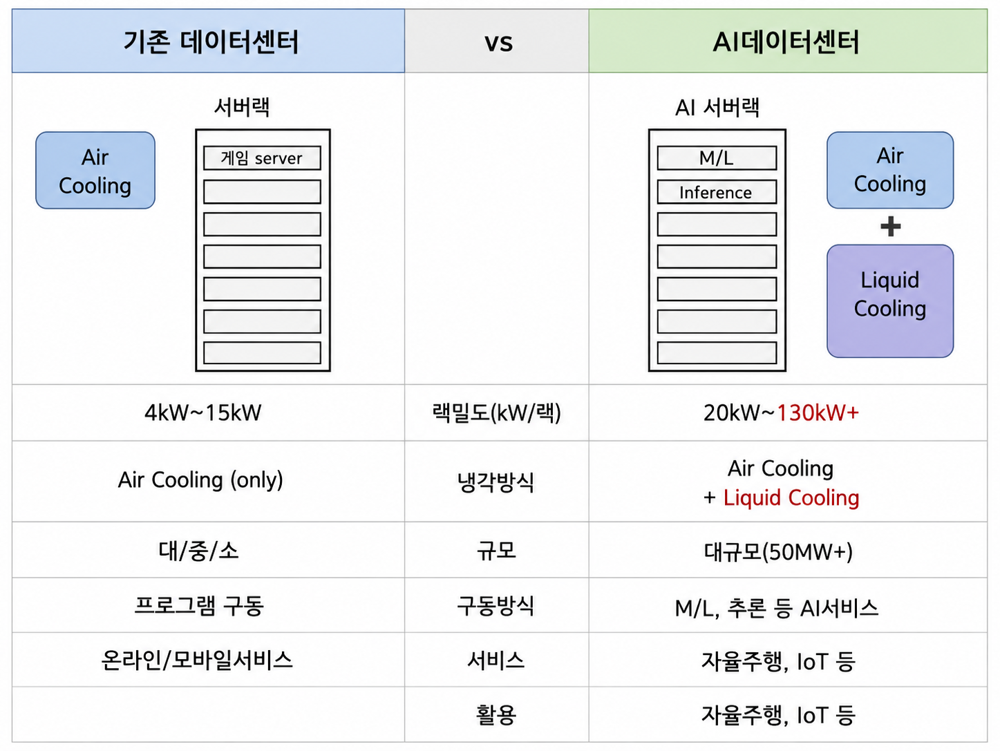

# 액체 냉각: 공기로 안 되면 물로

[앞 글](../power-and-cooling/)에서 공랭이 막히는 지점을 봤다. AI 랙은 40kW를 넘기는데 그만한 풍량을 물리적으로 못 만들고, 팬을 키우면 그 팬 전력이 또 열을 보탠다. 그래서 냉각 매체를 공기에서 물로 바꾼다. 여름에 선풍기 앞에 앉는 것보다 물에 뛰어드는 게 훨씬 시원한 것과 같은 얘기다. 이 글은 교재 [AI Data Center Networking](https://learning.oreilly.com/library/view/ai-data-center/9780135436370/)의 Liquid Cooling 절을 중심으로, 물이 왜 그렇게 유리한지부터 엔비디아가 고른 방식까지 정리했다.

## 물이 공기보다 3,000배

같은 부피로 물은 공기보다 3,000배 넘는 열을 나른다. 그 차이는 두 물성치에서 나온다. 밀도와 비열이다.

| 항목 | 공기 | 물 |
|---|---|---|
| 밀도 | 약 1.2 kg/m³ | 약 1,000 kg/m³ |
| 비열 | 약 1.0 kJ/kg·K | 약 4.18 kJ/kg·K |
| 열전도율 | 약 0.026 W/m·K | 약 0.6 W/m·K |
| 누수 위험 | 없음 | 있음 |
| 설비 난이도 | 낮음 | 높음 |

열을 얼마나 나르는지는 `Q = m × Cp × ΔT`로 본다. 질량유량이 크고 비열이 클수록 같은 온도차로 더 많은 열을 가져간다. 물은 밀도가 공기의 830배, 비열이 4배라 곱하면 압도적으로 유리하다. 대신 누수 위험이 있고 설비가 까다롭다는 대가가 따른다. 그 대가를 감수하고 갈 만큼 AI 칩의 발열이 커진 게 지금이다. ASHRAE도 CPU 전력이 일정 선을 넘으면 공랭 대신 액랭을 권한다.

## 액침은 왜 안 갔나

가장 강력한 액체 냉각은 immersion, 장비를 통째로 절연성 냉각액에 담그는 액침이다. 일반 물이 아니라 전기가 통하지 않는 특수 냉각액을 쓰고, 냉각액이 계속 액체로 도는 single-phase와 끓어 기체가 됐다가 다시 응축되는 two-phase로 갈린다. 냉각 효율은 가장 높지만 서버에서 팬을 떼고 부품을 냉각액 호환으로 바꿔야 하고, 랙 대신 탱크형 구조에 케이블 인입과 유지보수, 소방 기준까지 전부 달라진다. 데이터센터와 장비가 처음부터 immersion을 전제로 설계돼야 한다는 뜻이다.

문제는 엔비디아가 액침 방식 서버는 품질 보증을 못 하겠다고 선을 그었다는 점이다. AI의 핵심인 GPU를 액침 pod에 담그지 못하니, 서버 업체들은 어쩔 수 없이 DLC 쪽으로 갔다.

## 네 가지 방식

교재는 액체 냉각을 네 가지로 나눈다. 효율이 높은 순서와 장비를 얼마나 뜯어고쳐야 하는지가 대체로 반비례한다.

| 방식 | 냉각 위치 | 장비 개조 | 실무 감각 |
|---|---|---|---|
| Immersion | 장비 전체 | 매우 높음 | 데이터센터 구조 자체가 바뀜 |
| Cold Plate | CPU/GPU 칩 위 | 중간 | AI GPU 서버에서 가장 현실적 |
| Rear-Door HX | 랙 후면 배기 | 낮음 | 기존 공랭 유지하며 열만 줄이는 보조 |
| Sprayed | 발열 부품 표면 | 높음 | 타깃 냉각은 좋으나 특수 설계 |

엔비디아가 사실상 표준으로 민 건 cold plate, 곧 Direct-to-Chip 방식이다. GPU나 CPU처럼 발열이 큰 칩 위에 냉각판(cold plate)을 맞붙이고 그 안으로 차가운 액체를 흘려 칩 가까이에서 열을 직접 빼앗는다. 장비 전체를 담그지 않고 발열원 근처에만 액냉 구조를 붙이니 기존 랙·서버 구조와 더 잘 맞는다. 발열이 심한 GPU·CPU는 cold plate로 잡고 NIC나 DIMM, SSD, PSU처럼 덜 뜨거운 부품은 여전히 공기로 식혀서, 공랭과 액냉을 같이 쓰는 hybrid cooling이라고도 부른다.

cold plate에도 대가가 있다. 랙 안으로 냉각수 배관이 들어오니 전자장비 근처에 액체가 흐르고, 누수 감지와 차단이 필요하다. 서버를 갈 때 quick disconnect로 배관을 끊어야 하고, 유량이 모자라면 과열이 나며, 외부 CDU(Cooling Distribution Unit)나 시설 냉각수와 엮어야 한다. 나머지 둘 중 rear-door heat exchanger는 랙 뒷문을 라디에이터로 만들어 장비는 그대로 공랭으로 두고 배기열만 물로 식히는 보조 방식이고, sprayed는 노즐로 냉각액을 부품 표면에 직접 뿌리는 방식인데 공랭 대비 총 에너지를 25.8% 줄일 수 있다는 주장이 있지만 노즐 관리와 운영 복잡도가 높다.

## 공기 흐름 방향도 설계다

액냉으로 가도 모든 부품을 물로 식히는 건 아니라서 공기 흐름은 여전히 설계 변수다. 그리고 이건 장비를 주문하기 전에 정해야 한다. 한 번 깔면 hot/cold aisle 방향, 랙 배치, 서버·스위치 팬 방향, 케이블링이 다 거기 묶여서 사실상 못 바꾼다.

| 방식 | 흐름 | 특징 |
|---|---|---|
| Front-to-Back | 앞 to 뒤 | optics를 먼저 냉각, 일반적으로 선호 |
| Back-to-Front | 뒤 to 앞 | PSU를 먼저 냉각, optics는 데워진 공기를 받음 |
| Bidirectional | 양방향 전환 | 유연하나 설계 복잡, 비용 높음 |

스위치는 전면에 포트와 광모듈이 몰려 있다. front-to-back은 찬 공기가 그 광모듈을 가장 먼저 지나서, 포트당 10W를 넘기는 400G/800G optics 냉각에 유리하다. back-to-front는 PSU와 내부 보드를 먼저 식히고 마지막에 전면 optics에 닿아서, 광모듈이 이미 데워진 공기를 받는다. 고전력 optics 환경에서 이 차이가 발열 마진을 깎는다.

## 물까지 갔더니 보이는 그림

방향이 분명해진 건 엔비디아가 [45도 고온 액체 냉각으로 물 사용량을 거의 제로](https://devday.kr/article/nvidia-45c-liquid-cooling-near-zero-water-use)로 줄이는 설계를 내놓으면서다. 기존 데이터센터에서 40%까지 가던 냉각 에너지 비중을 크게 줄이고, 팬 없는 완전 액냉으로 가는 방향이다. 랙 밀도 숫자는 더 가파르다. 한 [코로케이션 분석](https://introl.com/ko/blog/colocation-provider-selection-ai-dgx-ready-120kw-rack-requirements)은 GB200 NVL72가 120kW에서 돌고 Vera Rubin NVL144가 2026년까지 랙당 600kW를 목표로 한다고 짚는다. 20kW 랙은 이제 목표가 아니라 기본이고, 액냉 도입률이 데이터센터의 22%에 이르렀다는 수치도 같이 나온다.

여기서 전력·냉각 얘기가 [엔비디아 세대별 랙 진화](../nvidia-rack-evolution/)와 만난다. GB200이 GPU만 수냉으로 식히다가 Vera Rubin에서 케이블과 호스와 팬까지 트레이에서 걷어내고 모든 부품을 물로 식히는 흐름이, 위에서 본 공랭의 천장을 정확히 따라간 결과다.
