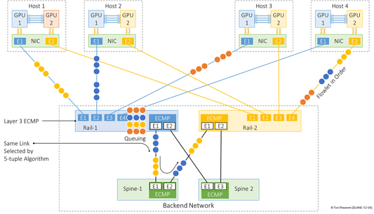
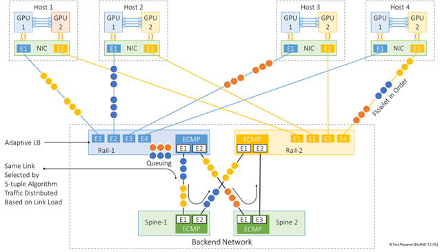
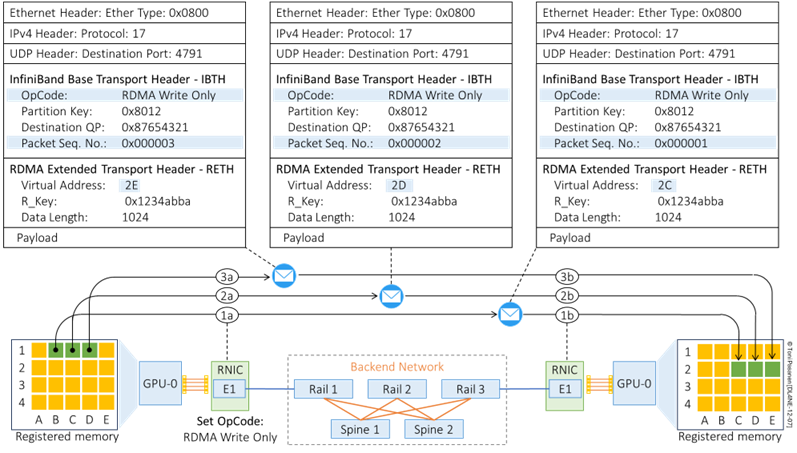
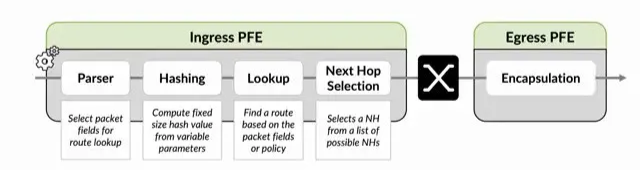

# AI 패브릭 로드밸런싱: ECMP를 넘어 packet spraying까지

3주차 후반의 주제는 분명한 한 가지 질문에 걸려 있다. RoCEv2 기반 AI 백엔드 네트워크에서 GPU 사이 대용량 RDMA 트래픽을 여러 경로에 어떻게 고르게 나누느냐다. 교재는 Toni Pasanen의 [AI for Network Engineers Ch12](https://nwktimes.blogspot.com/2025/04/ai-for-network-engineers-understanding.html)를 따라갔고, 여기에 라우터 내부 로드밸런싱을 다룬 발표([All About Load Balancing in your Routers](https://www.youtube.com/watch?v=UTz196HSHY4))를 곁들였다.

## 왜 ECMP가 AI 패브릭에서 부족한가

일반 데이터센터의 L3 ECMP는 5-tuple 해시로 flow를 여러 등가 경로 중 하나에 배정한다.

```text
Source IP / Destination IP / Source Port / Destination Port / Protocol
```

핵심 전제는 한 flow의 모든 패킷이 같은 경로를 탄다는 거다. 일반 웹 트래픽처럼 작고 다양한 flow가 수없이 많으면 해시가 평균적으로 경로를 잘 흩는다. 그런데 AI 학습 트래픽은 정반대다. GPU-to-GPU 통신은 RDMA NIC이 line rate에 가깝게 쏘는 elephant flow이고, AllReduce·AllGather·broadcast 같은 collective가 그런 대형 flow를 동시에 만든다. flow 수가 적고 크기가 크니, 해시가 여러 elephant flow를 같은 uplink에 몰아넣는 일이 쉽게 생긴다.



이게 hash polarization이다. 결과는 한 spine 경로에 트래픽이 집중되고 egress buffer가 쌓여 ECN/PFC가 뜨고, gradient 동기화가 지연되는 흐름이다. 전체 fabric 용량이 충분해도 특정 link만 막혀서 그 한 경로가 전체 training iteration을 잡아끈다. ECMP는 flow별 순서를 지키는 데는 좋지만, AI 백엔드에선 link 활용률을 들쭉날쭉하게 만든다.

## RDMA Write는 순서에 민감하다

로드밸런싱 방식을 이해하려면 RDMA Write의 패킷 구조를 먼저 봐야 한다. 큰 RDMA Write 하나는 보통 여러 패킷으로 쪼개진다.

```text
RDMA Write First -> RDMA Write Middle -> ... -> RDMA Write Last
```

First 패킷만 RETH(RDMA Extended Transport Header)를 품는다. RETH에는 수신 측이 데이터를 어디에 쓸지 알려주는 정보가 들어 있다.

- Virtual Address: 목적지 GPU 메모리의 쓸 위치
- R_Key: 그 메모리에 쓸 권한을 증명하는 토큰
- Length: 쓸 데이터 길이

Middle과 Last 패킷은 이 전체 주소 정보를 다시 갖지 않고, 앞선 First의 context와 PSN(Packet Sequence Number) 순서에 기대 이어지는 메모리 위치에 쓴다. 그래서 순서가 중요하다. 패킷이 out-of-order로 도착하면 수신 NIC이 바로 처리하지 못하고 버퍼링해야 하고, 고속 환경에선 그 buffer pressure가 packet drop으로 번진다. 이 순서 의존성이 뒤에 나올 packet spraying과 정면으로 부딪힌다.

## flowlet adaptive routing: 끊긴 자리에서 경로를 바꾼다

첫 번째 대안은 flow를 통째로 옮기지 않고 flowlet 단위로 쪼개는 거다. flowlet은 한 flow 안에서 패킷이 충분한 간격을 두고 끊기는 burst 묶음이다. adaptive routing은 이 flowlet을 congestion 상태에 따라 다른 경로로 보낸다.



처음엔 ECMP 해시가 flowlet들을 Spine-1으로 보내다가, Rail-1과 Spine-1 사이 link 사용률이 threshold를 넘으면 adaptive routing이 이를 감지해 일부 flowlet을 Spine-2로 돌린다. flowlet 사이엔 이미 시간 간격이 있어서, 경로를 바꿔도 같은 flowlet 안 패킷 순서는 유지하기 쉽다. 그래서 flow-based ECMP보다 유연하면서 packet spraying보다 reordering 위험이 낮은 중간 지점이 된다.

## packet spraying과 그 함정

두 번째 대안은 더 과감하다. 같은 flow 안 개별 패킷을 여러 등가 경로에 흩뿌린다.

```text
Packet 1 -> Spine-1
Packet 2 -> Spine-2
Packet 3 -> Spine-1
Packet 4 -> Spine-2
```

link 사용률을 가장 세밀하게 균등화할 수 있다는 게 장점이다. 문제는 경로마다 지연이 달라 패킷이 out-of-order로 도착한다는 거다. 앞에서 본 RDMA Write First/Middle/Last 구조에선 Middle/Last가 First의 RETH context와 PSN 순서에 의존하니, reordering이 생기면 수신 NIC이 버퍼링해야 하고 buffer pressure와 packet drop, 처리 overhead가 다 같이 늘어 RDMA 성능이 떨어진다. 그냥 뿌리면 안 된다는 얘기다.

## RDMA Write Only가 여는 길

그래서 packet spraying을 쓰려면 패킷이 순서에 덜 기대게 만들어야 한다. NVIDIA ConnectX-5 이후 RDMA NIC이 지원하는 RDMA Write Only가 그 길이다. 이 방식에선 모든 패킷이 저마다 RETH를 품는다.



패킷마다 목적지 메모리 주소 정보가 들어 있으니 self-contained가 되고, 앞선 패킷 context에 덜 의존한다. 다른 경로로 흩어져 순서가 뒤바뀌어 도착해도 수신 NIC이 각 패킷을 올바른 메모리 위치에 바로 쓸 수 있다. 이 구조 위에서 비로소 per-packet 로드밸런싱이 현실이 된다. 패브릭은 패킷을 여러 경로로 뿌려 hotspot을 줄이고, 수신 NIC은 reordering을 감당한다.

## Cisco Nexus DLB 예시

교재는 Cisco Nexus 9000 Cloud Scale 일부 스위치가 NX-OS 10.5(1)F 이후 flowlet 기반과 per-packet 로드밸런싱을 지원한다고 짚는다(DLB, Dynamic Load Balancing).

```bash
switch(config)# hardware profile dlb
switch(config-dlb)# dlb-interface Eth1/1
switch(config-dlb)# dlb-interface Eth1/2
switch(config-dlb)# mode per-packet
```

운영상 주의점이 따라붙는다. DLB가 적용된 flow엔 egress QoS와 access policy가 안 먹을 수 있고, egress 인터페이스의 TX SPAN이 DLB 트래픽을 캡처 못 할 수 있다. DLB MAC은 특정 물리 인터페이스에 묶이지 않는 virtual next-hop처럼 동작해서, 참여 스위치들이 같은 DLB MAC을 일관되게 설정해야 한다. 트래픽 분산엔 유용하지만 observability와 정책 적용 방식이 달라지니 검증이 필요하다.

## 라우터는 로드밸런싱을 어떻게 분류하나

곁들인 발표는 이 문제를 라우터 내부 관점에서 정리한다. 로드밸런싱을 단순 ECMP 설정이 아니라, PFE/ASIC이 패킷을 parsing하고 hash key로 selector table을 조회하는 파이프라인 위의 선택으로 본다.



분류는 두 축이다. 패킷 헤더·해시만 보는 static이냐 link 상태 같은 실시간 metric도 보는 dynamic이냐, 그리고 로컬 장비 상태만 보는 local이냐 이웃이 광고하는 remote 상태까지 보는 global이냐다.

| 분류 | 본다 |
|---|---|
| Static Local | 전통적 ECMP/SLB, 해시만 |
| Dynamic Local | ALB/DLB, 로컬 link 사용률·버퍼·큐 |
| Dynamic Global | GLB, 이웃이 광고하는 remote 경로 품질 |

use case마다 답이 다르다. 짧은 flow가 다양한 ISP/Enterprise는 entropy가 높아 ECMP/SLB로 충분하다. session state가 특정 노드에 묶인 anycast/stateful 서비스는 forward와 return이 같은 노드를 지나야 해서 symmetric hashing과 deterministic 분산이 필요하다. AI 데이터센터는 적은 수의 elephant flow가 문제라, DLB/ALB와 GLB, flowlet, packet spraying에 NIC의 reordering 처리 능력까지 엮어야 한다. 특히 AI/RDMA에선 기본 5-tuple만으로 entropy가 모자랄 수 있어 RoCEv2 BTH나 QP 같은 필드를 해시에 더하는 걸 고려한다.

## 정리

| 방식 | 단위 | 장점 | 한계 |
|---|---|---|---|
| Flow-based ECMP | Flow | 순서 보장, 단순 | elephant flow hash polarization |
| Flowlet adaptive routing | Flowlet | 활용률 개선, reordering 낮음 | flowlet gap/threshold 판단 필요 |
| Packet spraying | Packet | 경로 분산 가장 세밀 | reordering 위험, self-contained 패킷 필요 |

세 방식을 한 줄로 줄이면 이렇다. Flow ECMP는 단순하지만 elephant flow 쏠림에 약하고, flowlet adaptive routing은 혼잡한 경로를 피해 재분산하는 현실적 절충안이며, packet spraying은 활용률은 가장 높지만 RDMA의 out-of-order 문제를 RDMA Write Only 같은 구조로 먼저 풀어야 쓸 수 있다. 어느 쪽이든 ECN/PFC/DCQCN threshold와 로드밸런싱 정책이 서로 충돌하지 않는지가 마지막 점검 항목으로 남는다.
