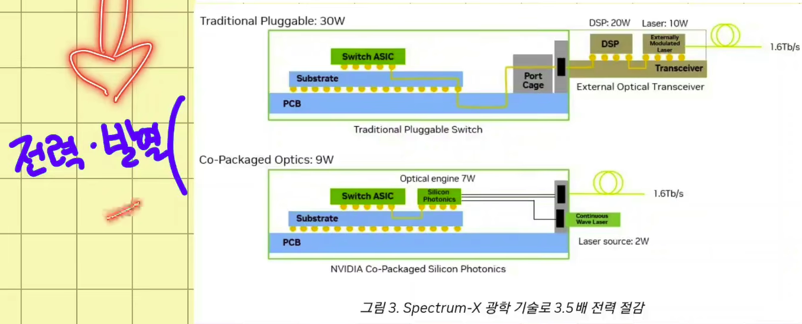
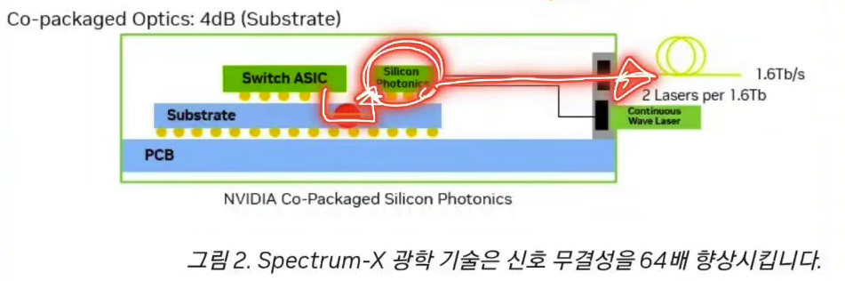

# 차세대 optics: DSP를 빼거나, 옮기거나, 통합하거나

[앞 글](../optics-and-cable/)에서 광 트랜시버 안 부품 중 DSP가 제일 비싸고 뜨겁다고 했다. 숫자로 보면 더 분명하다. pluggable optics에서 DSP는 모듈 BOM 비용의 20-40%를 차지하고, 트랜시버 전력의 약 50%를 먹는다. 속도가 800G, 1.6T, 3.2T로 오를수록 모듈 하나당 전력과 발열, 비용이 다 같이 커지고, 1RU 스위치에 포트를 더 넣기도 어려워진다. 그래서 업계가 던지는 질문이 하나로 모인다. DSP를 꼭 광모듈 안에 둬야 하나. 이 글은 교재 [AI Data Center Networking](https://learning.oreilly.com/library/view/ai-data-center/9780135436370/)의 Further Innovations in Optics 절을 따라 LPO·LRO·CPO를 정리했다.

## 기준점: pluggable optics

지금 표준은 광모듈 안에 DSP를 넣고 스위치 포트에 꽂는 pluggable 방식이다. 장점은 유연성이다. 모듈이 고장 나면 그것만 갈아끼우면 되고 벤더 교체도 상대적으로 쉽다. 대가가 위에서 말한 전력·비용·발열이다. 아래 세 기술은 전부 이 DSP를 어떻게 처리하느냐로 갈린다.

## LPO: DSP를 ASIC으로 넘긴다

LPO(Linear-drive Pluggable Optics)는 광모듈 안 DSP를 빼고 그 기능을 스위치의 PFE ASIC 쪽이 처리하게 한다. 모듈에서 DSP가 빠지니 모듈 전력과 발열이 줄고 BOM 비용도 내려간다. DSP가 ASIC 근처로 가면 ASIC 냉각 시스템을 같이 쓸 수 있어 냉각에도 유리하다. 에덴이 채널 정리에 따르면 전력이 절반 가까이 줄고 가격과 지연도 내려간다.

대신 리스크가 만만치 않다. DSP의 보정 없이 아날로그 신호로 버티니 거리가 짧아져 주로 30m급이고, 스위치 칩과의 상호운용성을 맞추기 까다롭다. 서로 다른 벤더 모듈·장비를 섞었을 때 호환이 어렵고, 대규모 배포에서 운영 검증 부담과 장애 분석 복잡도가 커진다. 성능은 좋아도 실운영 리스크가 큰 쪽이다.

## LRO: 절반만 뺀다

LRO(Linear Receive Optics)는 LPO와 pluggable의 절충이다. 수신 경로에선 DSP를 빼서 ASIC 쪽에 의존하고, 송신 경로엔 DSP를 그대로 둔다. 한쪽 경로에 DSP를 남겨 표준 준수와 상호운용성, 안정성을 어느 정도 챙기면서 전력은 LPO 방향으로 줄이려는 방식이다.

## CPO: 아예 스위치 안으로

CPO(Co-Packaged Optics)는 접근이 다르다. 광모듈을 포트에 꽂는 게 아니라 optics를 스위치 ASIC 바로 옆에 통합한다. 기존 구조에선 ASIC과 광모듈 사이를 전기 신호가 PCB trace를 타고 이동하는데, 속도가 오를수록 이 전기 경로에서 손실과 전력이 커진다. CPO는 그 경로를 거의 없애서 효율을 끌어올린다.

엔비디아 자료 기준으로 pluggable이 30W쯤 쓸 때 CPO는 9W로 약 3.5배 전력을 아낀다. 발열이 큰 칩 옆에 레이저를 두기 어려우니, 빛을 만드는 외부 레이저(Continuous Wave Laser)는 밖에 빼고 변조기만 ASIC 옆에 두는 구조다. 전기 경로가 짧아지니 신호 손실도 크게 준다.

CPO의 대가는 유연성이다. 필요한 포트에만 모듈을 꽂는 방식이 아니라서, optics에 문제가 생기면 모듈만 쏙 빼서 갈기 어렵다. 전구가 나가면 전구만 갈던 게 pluggable이라면, CPO는 조명 기구 안에 전구가 박혀 있어 기구 전체를 봐야 하는 셈이다. optics 장애가 스위치 교체·수리로 번질 수 있어 장애 도메인이 커지고, 생태계가 아직 무르익는 중이다.

## 한 장에 놓고 보면

| 항목 | Pluggable | LPO | LRO | CPO |
|---|---|---|---|---|
| DSP 위치 | 모듈 내부 | ASIC 쪽 | TX는 모듈, RX는 ASIC | ASIC 통합 |
| 유연성 | 매우 높음 | 중간 | 중간-높음 | 낮음 |
| 전력 | 높음 | 낮음 | 중간-낮음 | 낮음 |
| 교체성 | 모듈만 교체 | 모듈 교체 | 모듈 교체 | 어려움 |
| 상호운용성 | 높음 | 도전 과제 큼 | LPO보다 유리 | 생태계 성숙 필요 |
| AI/ML 적합성 | 현재 가장 현실적 | 저전력 후보 | 균형형 후보 | 장기 고밀도 후보 |

지금 가장 현실적인 건 여전히 pluggable이고, LPO·LRO는 저전력 후보, CPO는 장기 고밀도 후보다. 그런데 이 CPO가 더 이상 미래형 얘기만은 아니다. 엔비디아가 Vera Rubin 세대의 Spectrum-X 스위치에 CPO를 박기로 했고, 그러면서 스위치랙의 AEC까지 사라진다. 그 변화는 [세대별 랙 진화](../nvidia-rack-evolution/)에서 케이블 구성이 어떻게 바뀌는지로 이어진다.
