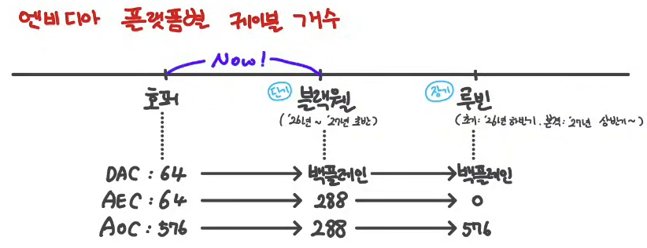

# 엔비디아 세대별 랙 진화: A100에서 Vera Rubin까지

앞 글들에서 따로 본 전력, 냉각, 케이블이 한 제품 안에서 어떻게 맞물리는지는 엔비디아 플랫폼의 세대 변화에서 제일 선명하게 보인다. 같은 'GPU를 빽빽이 묶는다'는 목표가 세대마다 랙 구조와 냉각 방식, 케이블 종류를 통째로 바꿔놨다. 이 글은 케이블 산업을 다루는 유튜브 채널 [에덴이_AiDataCenter](https://www.youtube.com/@%EC%97%90%EB%8D%B4%EC%9D%B4_AiDataCenter)의 세대별 정리와 CES 2026 발표 내용을 따라, A100부터 Vera Rubin까지 랙이 어떻게 변했는지 짚었다.

## 먼저 NVLink부터

랙을 묶는 기준선은 GPU끼리 잇는 NVLink 대역폭이다. 세대가 오르면 GPU 연산 성능만 오르는 게 아니라 GPU 사이 내부 통신 대역폭도 같이 오른다.

| 아키텍처 | GPU당 NVLink 대역폭 | GPU당 최대 연결 수 |
|---|---|---|
| Volta | 300 Gbps | 6 |
| Ampere | 600 Gbps | 12 |
| Hopper | 900 Gbps | 18 |
| Blackwell | 1,800 Gbps | 18 |
| Rubin | 3,600 Gbps | 36 |

이 대역폭이 커질수록 더 많은 GPU를 한 도메인으로 묶을 이유가 생기고, 그 묶음을 한 랙에 욱여넣으면서 전력 밀도와 발열이 따라 올라간다. 아래 세대 변화는 결국 이 표의 결과다.

## A100 (Ampere): 유연하게, 공랭으로

A100 시절엔 랙을 유연하게 짰다. 스위치를 랙 위에 두는 ToR 구조에 공랭이고, 랙 단위로 파는 제품이 아니라 필요한 대로 구성했다. GPU 노드와 상단 네트워크 스위치는 200G 구리선 40가닥으로 잇고, 랙과 랙 사이는 AOC 광케이블로 넘겼다. 구리가 주력이고 광은 랙을 넘을 때만 쓰는, 가장 단순한 그림이다.

## H100 (Hopper): 네트워크 랙이 갈라져 나온다

H100에선 GPU를 다른 랙끼리도 묶어야 해서 NVLink Switch를 위한 전용 네트워크 랙이 따로 생긴다. 아직 랙 단위 판매는 아니고, 스위치를 행 중간에 모으는 MoR 구조에 여전히 공랭이다. 컴퓨트 랙은 상단에 이더넷 스위치를 두고 서버 4대를 넣는데, 서버 한 대가 GPU 8개, CPU 2개, ConnectX 8개, NVSwitch 4개로 구성된다.

케이블이 위치마다 갈리기 시작하는 게 이 세대다. 스위치와 가까운 상단 서버는 DAC로, 조금 먼 하단 서버는 AEC로 ToR 스위치에 붙는다. 서버에서 NVLink Switch로 가는 구간은 구리로 거리는 닿지만 케이블이 두꺼워 앞면을 막고 냉기 순환을 해쳐서 AOC 광케이블을 쓴다. 거리만이 아니라 두께와 냉각이 케이블 선택을 가르기 시작한 셈이다.

## GB200 (Blackwell): 랙을 통째로 판다

GB200에서 큰 전환이 온다. 더 많은 GPU를 한 랙에 묶으면서 NVL72라는 랙 단위 제품이 나온다. 컴퓨트 서버 대신 컴퓨트 트레이 방식으로 바뀌어서, 트레이 한 대가 GPU 4개, CPU 2개, DPU 4개, ConnectX 4개를 담고, 이 트레이 18대를 쌓으면 `4 × 18 = 72`개 GPU가 모여 NVL72가 된다. 스위치를 행 끝에 두는 EoR 구조다.

냉각은 여기서 갈린다. 랙당 GPU가 빽빽해지면서 발열을 잡으려고 GPU는 수냉으로 식히고 나머지는 공냉으로 두는 hybrid로 간다. 그래서 랙 구역도 갈라진다. 수냉 배관 공사가 필요한 컴퓨트 랙 구역과, 아직 공랭이라 배관이 필요 없는 네트워크·관리 랙 구역을 분리한다. 랙 안 GPU 사이는 구리 백플레인으로 잇는데, 카트리지 안에 NVLink 케이블을 미리 연결해 팔아서 랙 내부에서 케이블이 사실상 사라진다. 외부 케이블은 스위치 랙과 가까운 1-4번 랙은 AEC로, 먼 5-8번 랙은 AOC로 거리에 따라 나눈다.

## VR200 (Vera Rubin): 케이블과 호스, 팬까지 걷어낸다

Vera Rubin은 EoR에 NVL72와 NVL144를 내놓으면서 냉각을 끝까지 민다. GPU만이 아니라 모든 부품을 수냉으로 식힌다. 그래서 컴퓨트 트레이 안에서 블랙웰까지 있던 케이블과 호스, 팬이 사라진다. 막는 게 없어지니 공기 순환이 좋아지고 쿨링 효과가 극대화되는 방향이다. 스위치 트레이는 NV 스위치 2개씩 랙당 9개, 곧 18개의 NVLink 6 Switch를 구리 백플레인으로 묶어서 NVL72 기준 위아래 36+36개 GPU가 1-hop으로 통신한다.

케이블 구성이 가장 많이 바뀐다. 랙 안은 백플레인이라 DAC가 없고, 스위치 랙의 AEC는 CPO 도입으로 사라지며, 광케이블 AOC는 scale-out 구간에만 남는다. Spectrum-X 이더넷 스위치에 [CPO](../next-gen-optics/)가 들어가서 광 트랜시버가 칩에 내장되고 스위치엔 순수 광케이블만 꽂힌다.

참고로 Rubin 플랫폼은 칩 6종으로 짜인다. 연산하는 Rubin GPU, 스케줄을 관리하는 Vera CPU, GPU 144개를 하나로 묶는 NVLink 6 Switch, NIC인 ConnectX-9, 네트워크·스토리지 트래픽을 CPU 대신 처리하는 BlueField-4 DPU, 그리고 랙 간을 잇는 Spectrum-6 이더넷 스위치다. NVLink C2C로 Rubin GPU와 Vera CPU가 하나의 거대한 코히런트 메모리로 묶인다.

세대를 한 줄로 보면 방향이 또렷하다. A100의 공랭·구리·유연 구성에서, GPU를 더 빽빽이 묶을수록 냉각이 공랭에서 GPU 수냉으로, 다시 전체 수냉으로 내려가고, 케이블이 DAC에서 AEC로, 백플레인으로, 끝내 CPO로 옮겨간다. [앞에서 본 공랭의 천장과 DSP의 전력 문제](../liquid-cooling/)가 제품 로드맵에 그대로 박혀 있는 셈이다.
