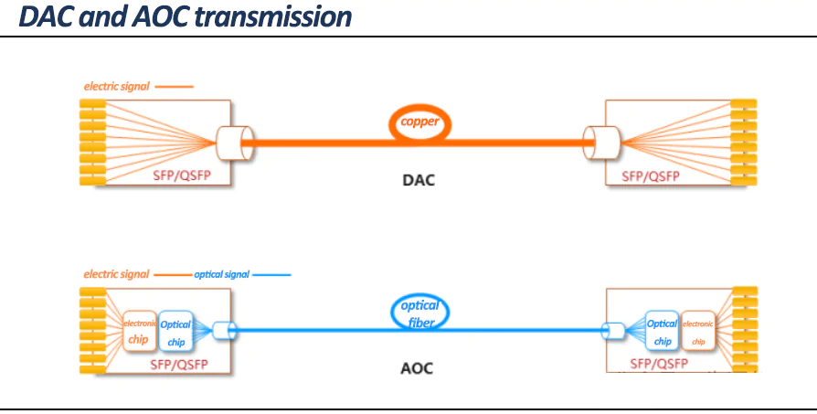
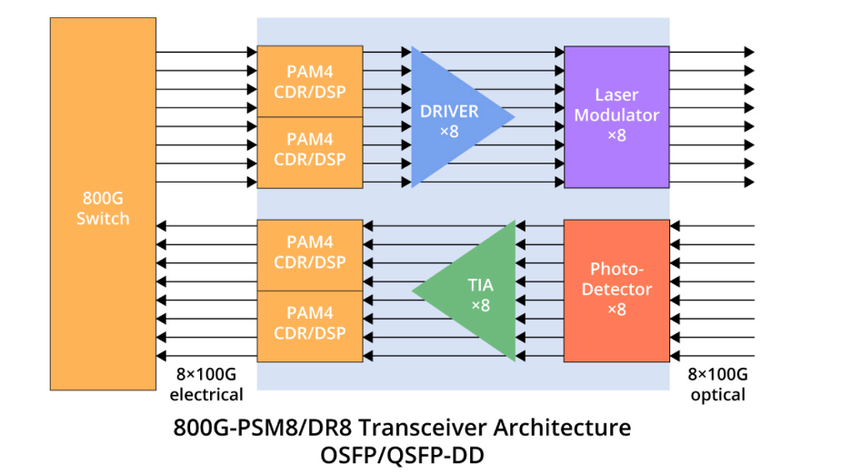

# 광모듈과 케이블: 신호가 실제로 지나가는 길

GPU와 스위치를 잇는 선은 한 종류가 아니다. 같은 랙 안 짧은 구간은 구리가 받고, 랙을 넘어가면 빛이 받는다. 그 사이에 거리·속도·전력·발열을 저울질한 여러 케이블과 광모듈이 있다. 이 글은 교재 [AI Data Center Networking](https://learning.oreilly.com/library/view/ai-data-center/9780135436370/)의 Optics and Cable 장과, 케이블 산업을 집요하게 파는 유튜브 채널 [에덴이_AiDataCenter](https://www.youtube.com/@%EC%97%90%EB%8D%B4%EC%9D%B4_AiDataCenter)를 같이 보면서 그 물리 계층을 정리했다.

## 구리냐 빛이냐

구리 케이블은 전기가 그대로 도체를 지나가니 별도 변환이 없다. 전력 소모도 지연도 낮다. 대신 고속이 될수록 표피효과로 신호가 약해져서 단거리에만 쓴다. 100Gbps 이더넷이면 구리는 대략 3m 안쪽이라, 같은 랙에서 서버와 ToR 스위치를 잇는 정도다. 광케이블은 유리섬유라 전기가 안 통해서, 전기를 빛으로 바꿨다 되돌리는 트랜시버가 양 끝에 필요하다. 변환 비용을 치르는 대신 거리·속도·전자기 간섭 모든 면에서 유리하다.

## DAC, AEC, AOC

랙 안팎 짧은 구간을 채우는 케이블이 세 종류다. 이름이 비슷해서 헷갈리는데 매체와 신호 보정 수준으로 갈린다.

| 구분 | 매체 | 신호 처리 | 일반 거리 |
|---|---|---|---|
| DAC | Copper | Passive는 없음, Active는 일부 | 매우 짧음 |
| AEC | Copper | 적극적 전기 신호 보정(retimer) | 고속 최대 약 7m |
| AOC | Fiber(주로 MMF) | 양 끝에 광 트랜시버 내장 | 최대 100m |

DAC(Direct Attach Copper)는 양 끝에 커넥터가 붙은 구리선이다. Passive DAC는 안에 전자 부품이 거의 없어 전력이 0.15W 미만이고 최대 7m, Active DAC는 신호 보정 회로를 넣어 10m까지 간다. 문제는 속도가 오를수록 케이블이 굵고 무거워진다는 거다. 굵은 DAC가 장비 앞을 막으면 냉기 순환을 방해해서, 그 한계를 보완한 AEC가 떠올랐다.

AEC(Active Electrical Cable)는 여전히 구리지만 커넥터 안에 리타이머라는 칩을 넣어, 표피효과로 약해진 신호를 증폭·복원하고 왜곡을 보정하고 클럭을 다시 맞춘다. 덕분에 DAC보다 가늘면서 800Gbps까지 노린다. AOC(Active Optical Cable)는 케이블 양 끝에 광전 변환 장치가 이미 붙은 광케이블이라, 구리보다 얇고 가벼워 100m까지 배선이 편하다.

## 광 트랜시버 안을 열어보면

광모듈은 단순히 빛을 켜고 끄는 부품이 아니다. 800G 트랜시버 한 개에 부품이 줄줄이 들어가고, 가격순으로 DSP가 50-100달러로 제일 비싸고 그다음이 EML 레이저, Driver IC, TIA 순이다.

- DSP(Digital Signal Processor): 깨지고 흔들린 고속 신호를 디지털로 보정해 ASIC이 읽게 만든다. 변조·복조, FEC 오류 정정, 클럭 복구, equalization을 담당한다. 1초에 수천억 번 연산해서 비싸고 뜨겁다.
- EML(Electro-absorption Modulated Laser): 송신부에서 전기를 빛으로 바꾼다. 일정한 빛을 내는 DFB 레이저(계속 켜진 손전등)와 그 앞에서 전기 신호대로 빛 세기를 조절하는 EA 모듈레이터(초고속 셔터)로 이뤄진다.
- Driver IC와 TIA: 둘 다 증폭기인데 방향이 반대다. Driver IC는 송신 때 DSP 신호를 레이저를 켤 만큼 키우고, TIA는 수신 때 광다이오드가 받은 미세 전류를 DSP가 읽을 전압으로 키운다.
- PD, TEC, Isolator: PD(Photo Diode)는 들어온 빛을 전기로 되돌리고, TEC는 온도에 민감한 레이저를 적정 온도로 잡아주며, Isolator는 밖에서 반사돼 역주행하는 빛을 막는다.

송신부 묶음(EML+TEC+Isolator)을 TOSA, 수신부 묶음(PD+TIA)을 ROSA라고 부른다. 한 신호가 지나가는 순서는 이렇다. 출발지 스위치 ASIC에서 나온 전기 신호가 DSP로 성형되고, Driver IC로 증폭돼 TOSA에서 빛으로 바뀌어 광섬유를 탄다. 반대편에선 ROSA의 PD가 빛을 전기로 되돌리고 TIA가 키우고 DSP가 다시 성형해 목적지 ASIC으로 들어간다. 참고로 스위치 ASIC 입장에선 400G/800G 포트 하나가 내부에서 여러 lane으로 쪼개진다. Demux가 800G를 8×100G 같은 lane으로 나누고 SerDes가 직렬·병렬을 변환해 PFE ASIC에 넘기는 식이다.

## NRZ에서 PAM4로

신호를 빛에 싣는 방식도 속도를 따라 바뀐다. NRZ는 빛 세기 2단계로 한 번에 1비트를 보낸다. PAM4는 4단계 밝기로 한 번에 2비트를 보내서 같은 보드레이트로 두 배를 나른다. 대신 단계 간격이 좁아져 신호가 더 민감해지고 노이즈에 약해진다. 그래서 PAM4에는 DSP의 보정이 더 절실하고, 800G 이상에서는 PAM4가 사실상 필수다.

## MMF와 SMF, 그리고 DWDM

광섬유는 빛이 지나는 길의 수로 갈린다. MMF(Multi-Mode Fiber)는 코어가 커서 여러 경로의 빛이 동시에 지난다. OM1이 62.5μm, OM2부터 OM5까지가 50μm 코어이고, LED나 VCSEL 같은 싼 광원을 쓸 수 있다. 대신 여러 경로의 빛이 도착 시간이 미세하게 달라져 신호가 퍼지므로 장거리엔 안 맞는다. SMF(Single-Mode Fiber)는 코어가 8-10μm로 좁아 빛이 한 경로만 지난다. 레이저 광원과 비싼 케이블을 쓰지만 1310nm, 1550nm 파장으로 장거리·고속·저왜곡에 강하다. 한 광섬유에 여러 파장을 동시에 실어 채널을 늘리는 DWDM은 데이터센터 사이를 잇는 초장거리 대용량 구간에서 쓴다.

## reach 등급: VR에서 ZR까지

트랜시버는 속도만 보고 고르는 게 아니라 거리와 매체로 타입이 갈린다. 같은 800G여도 랙 사이를 잇느냐 건물 사이를 잇느냐에 따라 다른 모듈을 쓴다.

| 타입 | 풀네임 | 거리 | 매체 |
|---|---|---|---|
| VR | Very Short Reach | 50m | MMF |
| SR | Short Reach | 100m | MMF |
| DR | Data Center Reach | 500m | SMF |
| FR | Far Reach | 2km | SMF |
| LR | Long Reach | 10km | SMF |
| ZR | Extended Reach | 80km 초과 | DWDM |
| CR | Copper | DAC 7-10m | Copper |

데이터홀 안 가까운 랙은 VR/SR(MMF)로 싸게 묶고, 건물이나 데이터센터를 넘으면 DR/FR/LR(SMF)로, 그 이상은 ZR(DWDM)로 간다. 랙 안 짧은 전기 구간은 CR, 곧 DAC/AEC가 받는다.

## 폼팩터: QSFP에서 OSFP로

모듈의 물리 규격도 속도를 따라 진화했다. 핵심은 lane 수와 lane당 속도다.

| 폼팩터 | 속도 | 구성 | 변조 |
|---|---|---|---|
| QSFP+ | 40G | 4 × 10G | NRZ |
| QSFP28 | 100G | 4 × 25G | NRZ |
| QSFP56 | 200G | 4 × 50G | PAM4 |
| QSFP-DD | 400G | 8 × 50G | PAM4 |
| OSFP | 400G/800G | 8 lane | PAM4 |

QSFP-DD는 기존 QSFP의 lane을 두 배(Double Density)로 늘린 규격으로 하위 호환이 좋아 기존 데이터센터의 400G 전환에 유리하다. OSFP(Octal SFP)는 처음부터 고속·고전력·방열을 더 세게 고려한 AI 시대용 규격이라 800G 패브릭에서 자주 쓴다. 속도가 오르면 광모듈이 작아도 발열이 커져서, QSFP-DD 케이지에 heat sink를 얹은 Type 2A 같은 변형이 나온다. 400G 이상에선 포트가 꽂히느냐보다 그 포트가 열을 감당하느냐가 문제가 된다. 커넥터는 보통 2심을 잇는 LC(SMF 장거리용)와 여러 가닥을 한데 묶는 MPO/MTP(SR8·DR4 같은 고밀도 breakout용)로 갈린다.

## 800G를 받는 법: breakout

서버 쪽 속도가 스위치 쪽보다 빠를 때 둘을 맞추는 방법이 breakout이다. 엔비디아 DGX B300은 GPU scale-out NIC가 ConnectX-8로 올라가면서 OSFP 포트 8개에 포트당 800G를 낸다. 그런데 스위치가 아직 400G 포트라면, 800G OSFP를 2×400G로 쪼개는 breakout 케이블로 leaf 스위치 두 대의 400G 포트에 나눠 꽂는다.

| 모델 | NIC | 포트당 속도 |
|---|---|---|
| DGX H100 / H200 / B200 | ConnectX-7 | 400G |
| DGX B300 | ConnectX-8 | 800G |

다만 InfiniBand에선 조심해야 한다. ConnectX-8 firmware release note에는 Quantum-3 스위치 포트 split과 single-port SuperNIC을 잇을 때 split 방식에 따라 link가 안 올라올 수 있다는 known issue와 workaround가 적혀 있다. 물리적으로 breakout이 가능하다는 것과 특정 구성이 공식 지원된다는 건 다른 얘기라, support matrix로 확인해야 한다.

여기까지가 지금 쓰는 광모듈이다. 그런데 속도가 800G, 1.6T로 오르면 트랜시버 안에서 제일 비싸고 뜨거운 DSP가 발목을 잡는다. 그걸 빼거나 옮기려는 [차세대 optics](../next-gen-optics/)가 다음 글이다.
