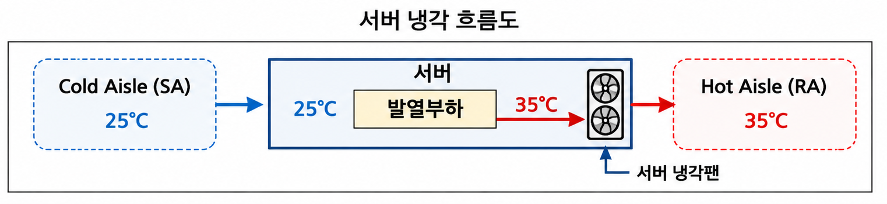
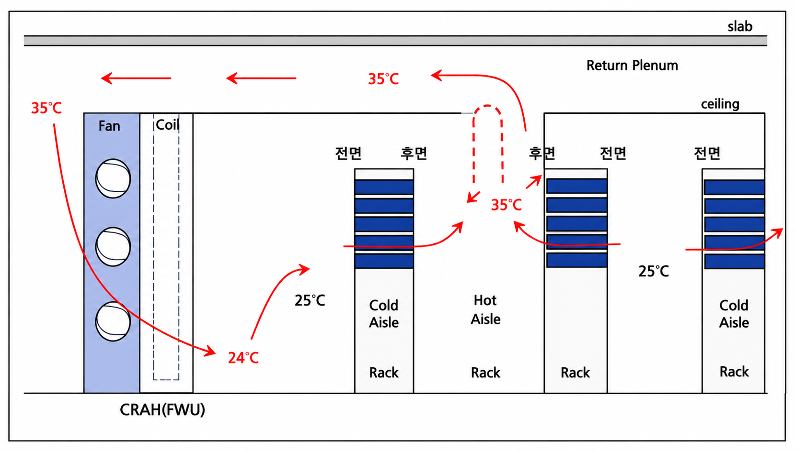

# 전력과 냉각: AI 랙은 결국 전기와 열의 문제다

네트워크 얘기를 하다가 갑자기 데이터센터 건물로 내려온 이유는 단순하다. GPU 클러스터를 키우려 할 때 제일 먼저 막히는 게 토폴로지가 아니라 전기와 열이라서다. 일반 서버 랙이 15kW쯤 쓸 때 AI 서버 랙은 40kW를 우습게 넘기고, 그 전력은 거의 전부 열로 바뀐다. 이번 글은 단행본 [AI시대에 난생처음 들어보는 데이터센터 이야기](https://product.kyobobook.co.kr/detail/S000219801640)와 교재 [AI Data Center Networking](https://learning.oreilly.com/library/view/ai-data-center/9780135436370/)의 Thermal/Power 장을 같이 보면서, 전기를 어떻게 끌어와 끊김 없이 대고 그 열을 공기로 어디까지 빼낼 수 있는지를 따라갔다.

## 땅보다 전기

데이터센터 부지를 고를 때 1순위는 넓은 땅이 아니라 전기를 확보할 수 있는 땅이다. 데이터센터에 들어오는 전기는 대부분 초고압이라, 우리나라 기준으로 22,900V(투투나인)나 154,000V(일오사)로 받는다. 이 선로를 보통 도로를 파고 지중에 묻는데, 같은 도로를 3년 안에 다시 못 파게 막는 지자체 규정 때문에 인입 공사 한 번 놓치면 몇 년을 기다리는 일도 생긴다. 거리가 멀수록 공사비가 비례해서 늘고 유지보수 중 전력관을 건드릴 위험도 커진다. 수도권은 발전소 짓기가 어려워 지방 전기를 송전탑으로 끌어와야 하는데 그 송전탑 민원이 또 걸려서, 늘 전기가 모자란 쪽이다.

그래서 전력 인입은 처음부터 이중화로 짠다. 발전소 두 곳 이상과 변전소 두 곳 이상을 전력케이블로 엮어서 한 곳이 죽어도 공급이 끊기지 않게 하고, 한전 인입 선로도 주/예비로 나눈다. 네트워크도 마찬가지라 통신선로는 최소 이중 인입이고, 고객은 보통 POE(Point of Entrance)를 세 군데 이상 요구한다.

## 끊기면 20ms 안에 살려야 한다

전원 시설에서 제일 중요한 건 무정전, 그러니까 UPS(Uninterrupted Power Supply)다. 서버는 정전이 나도 약 20ms 안에 전기가 다시 들어오면 별 탈 없이 버틴다. 내부 캐패시터가 짧은 전기 버퍼 역할을 해주기 때문이다. UPS는 평소 배터리를 충전해 두다가 정전이 나면 3-5ms 안에 그 배터리로 전기를 공급한다. 배터리 용량은 보통 10분치만 둔다. 길게 버티려고 두는 게 아니라, 비상발전기가 일어설 때까지의 징검다리이기 때문이다.

정전과 동시에 비상발전기(EDG, Emergency Diesel Generator)가 시동을 거는데, 정격 용량에 도달하기까지 15-30초가 걸린다. 그 사이를 UPS가 메우는 구조다. 그래서 비상발전기는 시동이 잘 걸리고 정격까지 빨리 올라오는 게 생명이라, 발전기실을 약간 따뜻하게 유지한다. 배터리는 예전엔 납배터리를 썼지만 부피와 무게 때문에 요즘 대용량은 거의 리튬이온으로 간다.

한전에서 154kV 같은 초고압으로 받는 건 송전 효율 때문이다. 전력은 대략 `P = V × I`라서 같은 전력을 보낼 때 전압을 높이면 전류를 낮출 수 있고, 전선 손실은 전류의 제곱에 비례하는 `I²R`이라 전류가 작을수록 손실이 확 준다. 그래서 장거리는 고전압 저전류가 유리하고, 받은 뒤엔 변압기로 380V 저압이나 6,600V 중압으로 감압해서 쓴다. 수전 용량이 40MW를 넘으면 보통 154kV로 받는다.

## PUE: 전기의 얼마가 일을 하나

냉방으로 넘어가기 전에 효율 지표 하나를 잡고 간다. PUE(Power Usage Effectiveness)는 데이터센터 전체 전력을 IT 장비 전력으로 나눈 값이다. IT 장비가 10MW를 쓰는데 센터 전체가 15MW를 쓴다면 PUE는 1.5다. 이상값은 1.0인데, 이건 냉각도 UPS 손실도 조명도 없이 전기가 전부 IT 장비로만 간다는 뜻이라 현실에선 불가능하다. 전형적인 배분을 보면 IT 장비가 40-45%, 냉각이 35-40%다. 냉각이 IT 장비 다음으로 큰 전력 소비원이라는 게 핵심이고, AI 클러스터는 IT 전력 자체가 워낙 커서 PUE를 조금만 낮춰도 절감액이 크다.

## 서버는 공기로 식는다

서버 냉각의 기본은 공기 순환이다. 서버는 앞쪽 Cold Aisle의 25도 찬 공기를 자체 냉각팬으로 빨아들여 내부 열을 떼어내고, 뒤쪽으로 35도까지 데워진 공기를 Hot Aisle에 뱉는다. 그 더운 공기를 냉방시스템이 다시 24도로 식혀 Cold Aisle로 보내는 순환을 공조라고 부른다.



여기서 풍량 계산이 중요한 직관을 준다. 서버가 소비한 전력은 거의 전부 열로 바뀌어서, 데이터센터 열 계산에선 서버 전력 1kW를 약 860 kcal/h의 발열로 본다. 냉방부하는 다음 식을 따른다.

```text
냉방부하(kcal/h) = 0.29 × 온도차(℃) × 풍량(m³/h)
```

0.29는 계수고, 냉방부하가 정해지면 온도차와 풍량은 서로 맞바꿀 수 있다. 온도차를 키우면 풍량을 줄여도 되고, 풍량을 키우면 온도차를 줄여도 된다. 랙밀도가 10kW면 발열량은 `10kW × 860 = 8,600 kcal/h`이고, Cold Aisle 25도와 Hot Aisle 35도의 온도차 10도를 식에 넣으면 랙당 `8,600 ÷ (0.29 × 10) ≈ 2,965 m³/h`, 분으로 환산하면 49.4 m³/min이 필요하다. 1kW로 나누면 4.94 m³/min이고, 실제로 서버는 보통 kW당 4.5 m³/min 이상의 풍량을 요구한다. 그래서 서버 입장에선 온도차보다 흡입 공기의 양, 즉 풍량이 먼저다.



이 풍량을 만드는 게 CRAH(Computer Room Air Handler)이고, 냉각 용량을 최대로 끌어내려고 바닥부터 천장까지 벽처럼 세운 형태가 FWU(Fan Wall Unit)다. FWU를 쓰려면 바닥에서 천장까지 높이가 최소 4.5m, 보통 8m쯤 필요하다. 일반 오피스 층고가 3.5-4m인 걸 생각하면 데이터홀은 처음부터 천장이 높은 건물이어야 한다는 얘기다. 참고로 데이터홀 바닥은 1U 서버 한 대가 15-20kg, 42U 표준 랙이 630-840kg에 랙 자체 무게와 배관까지 더해져서 1,200-2,400 kg/m²를 버텨야 한다. 일반 사무실이 250-300 kg/m²인 것과 비교하면 한참 무겁다.

## 공기가 막히는 지점

문제는 AI 랙이다. DGX H200 한 대가 8U에 10.2kW를 쓰는데, 한 랙에 4대만 넣어도 `10.2 × 4 = 40.8kW`다. 여기에 kW당 4.5 m³/min을 곱하면 랙당 183.6 m³/min을 공급해야 한다. 기존 15kW 랙용 FWU가 4.5m 높이였는데 풍량을 2.7배로 키우려면 단면적을 2.7배 키워야 하고, 그건 물리적으로 어렵다.

설사 키운다 해도 서버 안에서 또 막힌다. 풍량을 늘리려면 서버 내부 냉각팬을 더 키워야 하는데, 한정된 서버 공간에서 팬을 키우기도 어렵고, 키우면 그 팬이 먹는 전력이 늘어 또 그만큼의 발열과 냉기가 추가로 필요해진다. 공기로 식히는 건 이 지점에서 한계에 부딪힌다.

교재 쪽 숫자도 같은 그림이다. 일반 랙 전력 예산이 16-18kW인데, DGX H100 한 대(4+2 redundancy 기준 13.2kW)에 64×400G 스위치 한 대(약 3kW), 거기 꽂히는 OSFP 광모듈 64개(개당 15W면 0.96kW)만 더해도 17.16kW로 이미 일반 랙 한계에 닿는다. 빈 공간이 있다고 서버를 더 넣는 식이 통하지 않는다. 광모듈 하나는 작아도 고속 포트가 수십 개면 그 발열이 랙 설계에서 무시 못 할 변수가 된다.

| 광모듈 타입 | 최대 소비 전력 |
|---|---|
| QSFP28 | 약 3.2W |
| QSFP56-DD | 약 12W |
| OSFP | 약 15W |

여기까지가 공랭의 천장이다. 같은 부피로 공기보다 3,000배 넘는 열을 나르는 매체로 갈아타야 하는데, 그게 [액체 냉각](../liquid-cooling/)이다. 엔비디아가 GPU를 어디까지 물로 식히기로 했는지, 그리고 방식이 왜 액침이 아니라 cold plate인지는 다음 글에서 봤다.
